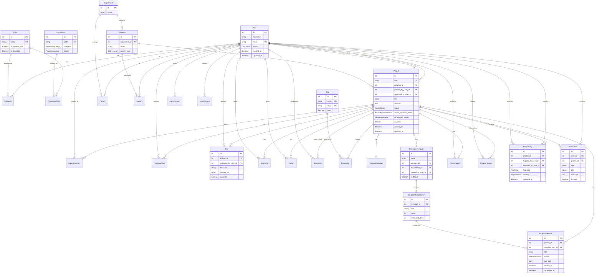
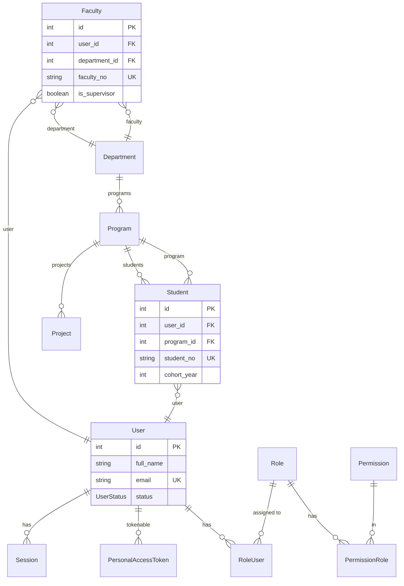
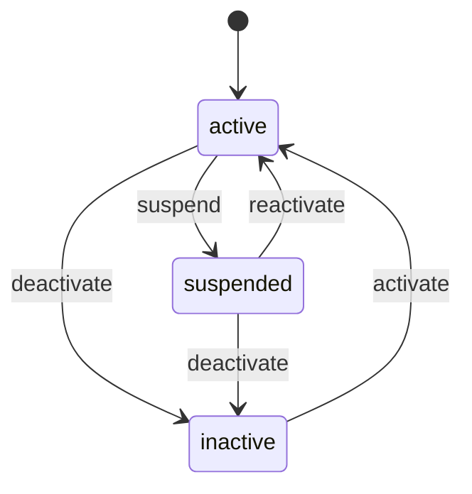
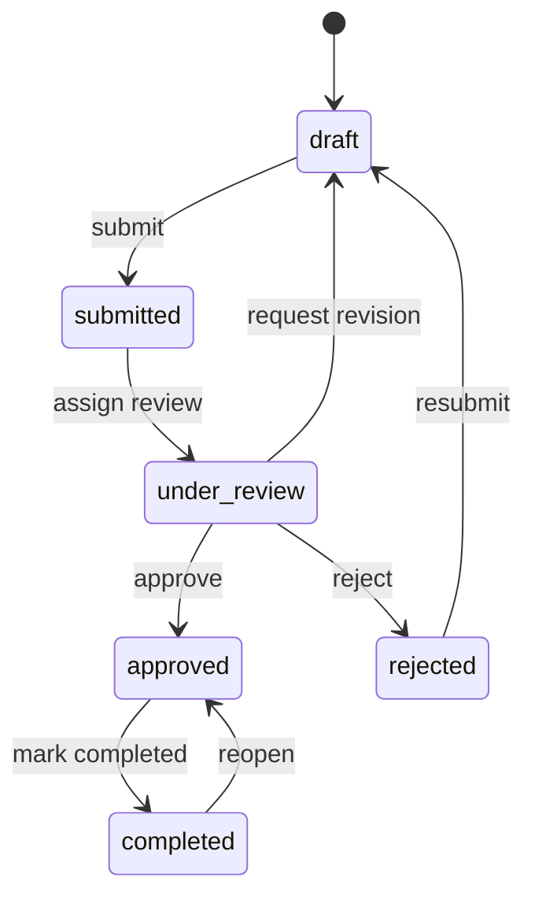
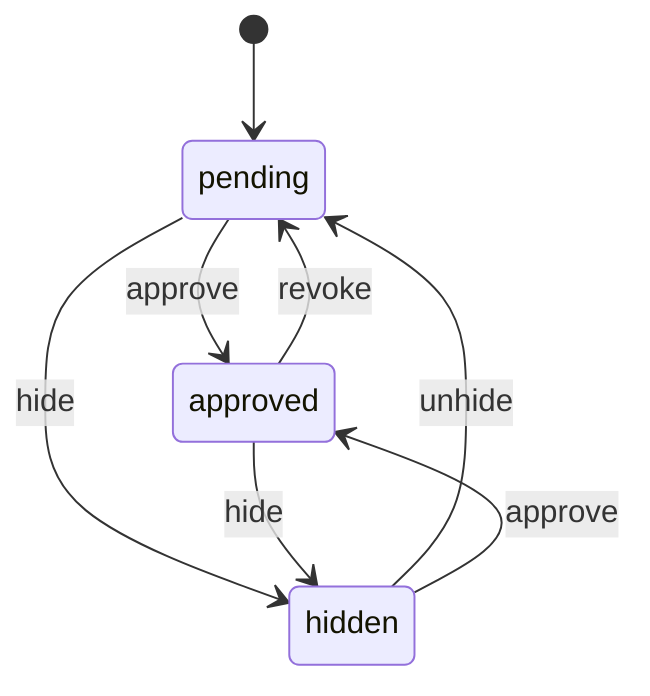
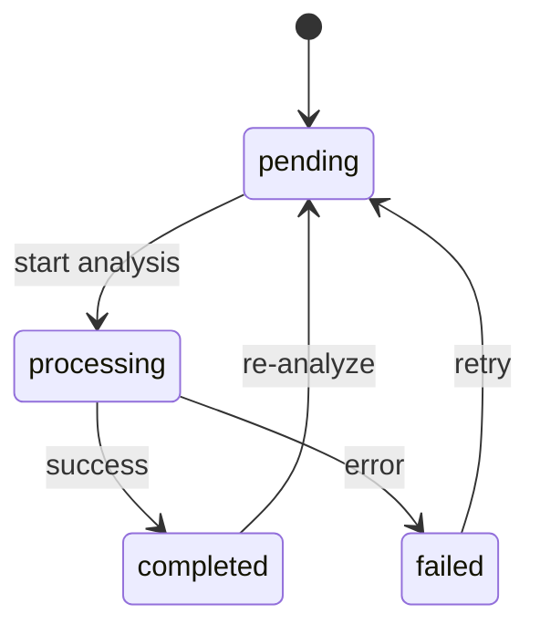
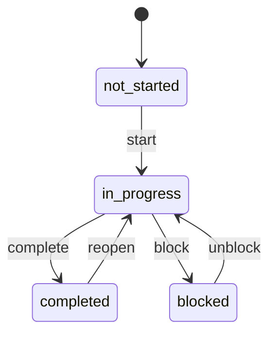
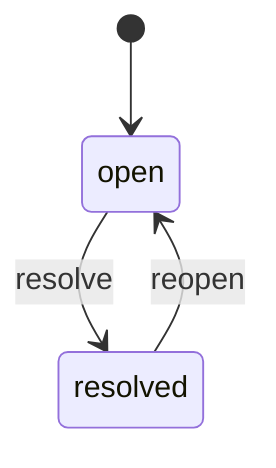
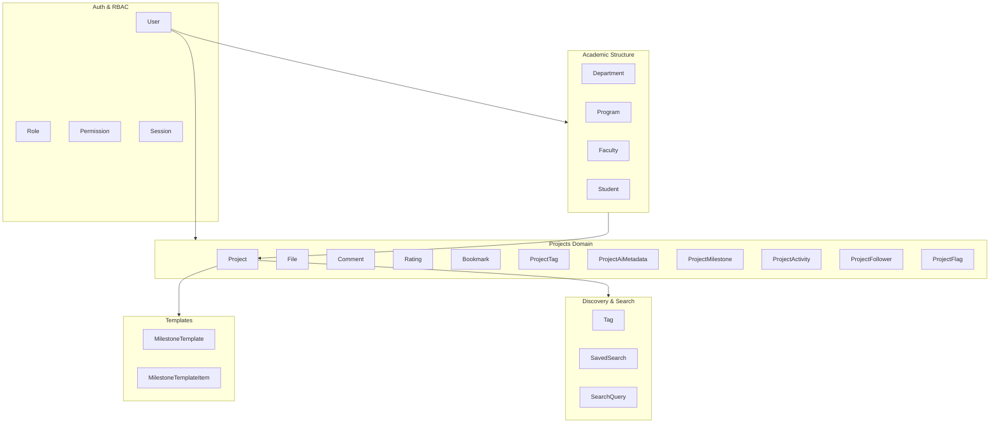
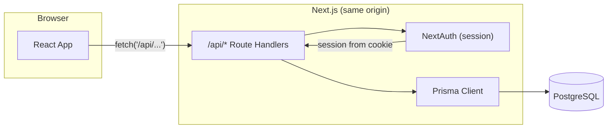

# Fahras — ERD & State Machines (Mermaid)

Entity-relationship and state-machine diagrams derived from `prisma/schema.prisma` and application constants.

---

## 1. Entity Relationship Diagram (Core)

---

## 2. Entity Relationship Diagram (Auth & Academic)

---

## 3. State Machine — User Status

User account lifecycle (admin toggle).

| State      | Description                    |
|-----------|---------------------------------|
| `active`   | User can log in and use the system |
| `inactive` | Account disabled, cannot log in    |
| `suspended`| Temporarily blocked               |

---

## 4. State Machine — Project Status (Workflow)

Project lifecycle from creation to completion.

| State          | Description                          |
|----------------|--------------------------------------|
| `draft`        | Work in progress, not submitted      |
| `submitted`    | Submitted for review                 |
| `under_review` | Being evaluated                      |
| `approved`     | Accepted and visible (if admin approved) |
| `rejected`     | Rejected; can resubmit from draft    |
| `completed`    | Project marked as finished          |

---

## 5. State Machine — Admin Approval Status

Visibility/approval of a project (admin-controlled).

| State     | Description                              |
|-----------|------------------------------------------|
| `pending` | Awaiting admin decision                  |
| `approved`| Listed and discoverable                 |
| `hidden`  | Not listed; may still be accessible by URL |

---

## 6. State Machine — AI Analysis Status

AI metadata analysis for a project.

| State        | Description                |
|-------------|----------------------------|
| `pending`   | Not yet analyzed           |
| `processing`| Analysis in progress       |
| `completed` | Analysis done; metadata set |
| `failed`    | Analysis error; can retry  |

---

## 7. State Machine — Milestone Status

Per-project milestone progress.

| State         | Description           |
|---------------|-----------------------|
| `not_started` | Not yet started       |
| `in_progress` | Work in progress      |
| `completed`   | Done                  |
| `blocked`     | Blocked by dependency or issue |

---

## 8. State Machine — Project Flag (Resolution)

Issue flags on a project (open vs resolved).

| State     | Description                    |
|-----------|--------------------------------|
| `open`    | `resolved_at` is null          |
| `resolved`| `resolved_at` set; has resolver and notes |

**Flag types:** `scope_creep`, `technical_blocker`, `team_conflict`, `resource_shortage`, `timeline_risk`, `other`  
**Severity:** `low`, `medium`, `high`, `critical`

---

## 9. Enums Reference (from Prisma)

| Enum                 | Values |
|----------------------|--------|
| `UserStatus`         | active, inactive, suspended |
| `ProjectStatus`      | draft, submitted, under_review, approved, rejected, completed |
| `AdminApprovalStatus`| pending, approved, hidden |
| `AiAnalysisStatus`   | pending, processing, completed, failed |
| `MilestoneStatus`    | not_started, in_progress, completed, blocked |
| `DegreeLevel`       | bachelor, master, phd |
| `Semester`          | fall, spring, summer |
| `MemberRole`        | LEAD, MEMBER |
| `AdvisorRole`       | MAIN, CO_ADVISOR, REVIEWER |
| `FlagType`          | scope_creep, technical_blocker, team_conflict, resource_shortage, timeline_risk, other |
| `FlagSeverity`      | low, medium, high, critical |
| `TagType`           | manual, ai_generated, system |
| `ProjectTagSource`  | manual, ai_suggested, ai_auto |
| `PermissionCategory`| Projects, Users, Files, Analytics, Settings, System, Roles |
| `PermissionScope`   | all, department, own, none |
| `ComplexityLevel`   | beginner, intermediate, advanced, expert |

---

## 10. High-Level Domain Overview

---

## 11. How Next.js Handles the Backend

This app does **not** call an external Laravel API. **Next.js is the backend**: the same app serves the React frontend and the API via Route Handlers and talks to PostgreSQL with Prisma.

### Request flow

### Pieces

| Layer | What it does |
|-------|-------------------------------|
| **Frontend** (`src/lib/api.ts`) | Calls relative URLs `fetch('/api/...')`. Sends `Accept: application/json` and optionally `Authorization: Bearer <token>` (legacy; see below). |
| **API routes** (`src/app/api/**/route.ts`) | Implement GET/POST/etc. They use **Prisma** for DB and **NextAuth** for auth. No proxy to Laravel. |
| **Auth** | **NextAuth** with Credentials provider and JWT session. Login is `signIn('credentials', { email, password })`; session is stored in a **cookie**. Server reads session via `auth()` in Route Handlers. |
| **Auth helpers** (`src/lib/auth-helpers.ts`, `src/middleware/auth.ts`) | `requireAuth()`, `optionalAuth()`, `requireRole()`, and route wrappers `withAuth()`, `withOptionalAuth()`, `withRole()` so handlers get a validated session or 401/403. |
| **Database** | **Prisma** as the only ORM; `prisma/schema.prisma` matches the DB. Laravel does not run in this stack; Prisma replaces it. |

### Auth note

- **Server-side**: Route Handlers use `auth()` (NextAuth), which uses the **session cookie**. Same-origin `fetch('/api/...')` sends that cookie automatically.
- **Client-side**: The app still has a Zustand auth store and `Authorization: Bearer` in `api.ts` (leftover from a previous Laravel/Sanctum setup). The routes that use `requireAuth()` / `withAuth()` rely on the **NextAuth session cookie**, not the Bearer token.

### Summary

- **Backend = Next.js API routes + Prisma + PostgreSQL.**
- **No Laravel in the request path** — frontend → Next.js `/api/*` → Prisma → DB.
- **Auth** = NextAuth (Credentials, JWT, cookie); protect routes with `withAuth` / `requireAuth` and optional role checks with `withRole` / `requireRole`.

---

*Generated from Fahras codebase — Prisma schema and app constants. Update this doc when schema or state transitions change.*
