# Fahras — Deep Project Analysis

**Date**: January 30, 2026  
**Project**: Fahras Graduation Project Archiving System  
**Status**: Production-Ready (Graduation Project)

---

## 1. What Is Fahras?

**Fahras** (فهرس — Arabic for "Index/Catalog") is a **graduation project archiving system** for Saudi Arabian technical colleges (TVTC — Technical and Vocational Training Corporation). It allows students to submit their graduation projects, faculty to supervise and evaluate them, and admins to manage the entire lifecycle — from submission to approval to public discovery.

**Core Mission**: Create a digital archive and discovery platform for academic projects with multi-stakeholder workflows (students, faculty, administrators, reviewers).

---

## 2. Technology Stack

### Infrastructure (Docker Compose — 8 services)

| Service | Image | Port | Purpose |
|---------|-------|------|---------|
| **Nginx** | `nginx:latest` | `80` | Reverse proxy, static files, API routing |
| **PHP-FPM** | `php:8.3-fpm` | `9000` | Laravel API runtime |
| **PostgreSQL** | `postgres:16-alpine` | `5433→5432` | Primary database (UTF-8 for Arabic) |
| **Redis 7** | `redis:7-alpine` | `6379` | Cache, sessions, queues (LRU, 256MB) |
| **MinIO** | `minio/minio:latest` | `9000/9001` | S3-compatible object storage |
| **Node.js** | `node:20-alpine` | `3000` | React dev server |
| **Laravel Init** | `php:8.3-fpm` | — | Auto migrations + seeding on startup |
| **MinIO Init** | `minio/mc:latest` | — | Auto bucket creation (`fahras-files`) |

### Backend Stack

| Layer | Technology | Version |
|-------|-----------|---------|
| **Framework** | Laravel | 11.46.1 |
| **Language** | PHP | 8.3 |
| **Auth** | Laravel Sanctum | 4.0 (SPA + Token) |
| **Database** | PostgreSQL | 16 |
| **Storage** | MinIO / AWS S3 / GCS / Azure / Dropbox | Multi-cloud |
| **Queue** | Redis | Background AI jobs |
| **Code Style** | Laravel Pint | — |
| **Testing** | PHPUnit | 11.0 |

### Frontend Stack

| Layer | Technology | Version |
|-------|-----------|---------|
| **Framework** | React | 19.1.1 |
| **Language** | TypeScript | 5.6.0 |
| **Build** | Vite | 6.0.1 |
| **UI Library** | Material-UI (MUI) | 7.3.2 |
| **State** | Zustand | 5.0.8 |
| **Routing** | React Router | 7.9.1 |
| **HTTP** | Axios | 1.12.2 |
| **Animation** | Framer Motion | 12.24 |
| **Virtualization** | react-window | 2.2.4 |
| **Command Palette** | cmdk | 1.0.0 |
| **RTL** | stylis-plugin-rtl | 2.1.1 |

### Key Production Features
- **Multi-stage Docker build** (Alpine images for minimal size)
- **Gzip compression**, security headers (CSP, X-Frame, XSS protection)
- **Unlimited file uploads** (configurable `client_max_body_size 0`)
- **Vite code splitting**: `vendor` (React/Router) + `mui` (Material-UI) chunks
- **512MB PHP memory**, 300s execution timeout
- **Health checks** on all services (every 10-30s)
- **Resource limits**: Nginx/PHP 2 CPU + 1GB, Node 2 CPU + 2GB

### System Architecture Diagram

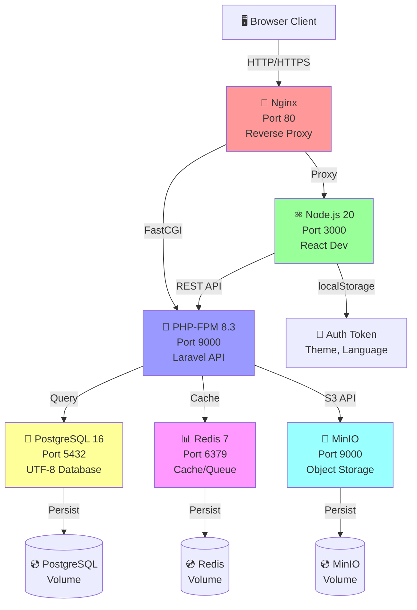

---

## 3. Architecture

### Backend: Domain-Driven Design (DDD) + Traditional Laravel

```
api/
├── app/
│   ├── Domains/                      ← DDD modules (isolated by feature)
│   │   └── Projects/
│   │       ├── Controllers/
│   │       │   ├── ProjectController (50+ methods: CRUD, search, approve, follow)
│   │       │   └── ProjectFollowController (activities, flags, followers, timeline)
│   │       ├── Models/
│   │       │   ├── Project (main model, slug-based routing)
│   │       │   ├── ProjectActivity (audit log)
│   │       │   ├── ProjectFollower (with notification preferences)
│   │       │   ├── ProjectFlag (issues with severity)
│   │       │   └── ProjectMilestone (with dependencies)
│   │       ├── Services/
│   │       │   ├── ProjectService (business logic)
│   │       │   ├── ProjectActivityService (static logging)
│   │       │   ├── ProjectMemberService (team management)
│   │       │   └── ProjectVisibilityService (permissions & approval)
│   │       └── Requests/
│   │           ├── StoreProjectRequest (validation)
│   │           ├── UpdateProjectRequest
│   │           └── SearchProjectRequest
│   │
│   ├── Http/Controllers/             ← Shared controllers (90 total routes)
│   │   ├── AuthController (register, login, logout, email verify, password reset)
│   │   ├── FileController (upload, download, delete — multi-cloud support)
│   │   ├── UserController (CRUD, status toggle)
│   │   ├── RoleController (RBAC management with scopes)
│   │   ├── NotificationController (CRUD, mark read, unread count)
│   │   ├── MilestoneController (CRUD, start/complete/reopen)
│   │   ├── MilestoneTemplateController (templates + apply to project)
│   │   ├── TagController (CRUD, AI-generated + manual)
│   │   ├── AiSearchController (NLP search, similarity, analytics)
│   │   └── SavedSearchController (saved queries, usage tracking)
│   │
│   ├── Models/                       ← 19 Eloquent models
│   │   ├── User, Role, Permission, Faculty, Student
│   │   ├── File, Comment, Rating, Notification, Bookmark
│   │   ├── Tag, ProjectAiMetadata, SavedSearch, SearchQuery
│   │   ├── MilestoneTemplate, MilestoneTemplateItem
│   │   ├── Program, Department, EmailVerification
│   │   └── All with relationships, scopes, casts, accessors
│   │
│   ├── Services/                     ← 3 business logic services
│   │   ├── AiAnalysisService (Gemini integration with retries)
│   │   ├── MilestoneTemplateService (template creation/application)
│   │   └── PermissionService (check action permissions)
│   │
│   ├── Jobs/
│   │   └── AnalyzeProjectWithAi (queued job, 3 retries with backoff)
│   │
│   ├── Constants/                    ← Enum-like constants
│   │   ├── ProjectStatus (draft, submitted, under_review, approved, rejected, completed)
│   │   ├── ApprovalStatus (pending, approved, rejected, hidden, needs_revision)
│   │   ├── MemberRole (LEAD, MEMBER)
│   │   └── AdvisorRole (MAIN, CO_ADVISOR, REVIEWER)
│   │
│   ├── Http/Middleware/
│   │   └── OptionalAuthSanctum (guest + auth on same route)
│   │
│   └── Providers/                    ← 4 service providers
│       ├── AppServiceProvider
│       ├── AuthServiceProvider
│       ├── EventServiceProvider
│       └── RouteServiceProvider
│
├── routes/api.php                    ← 100+ API endpoints grouped by feature
│
└── database/
    ├── migrations/                   (22 migrations, evolution timeline)
    └── seeders/                      (roles, permissions, users, departments, templates)
```

### Frontend: Feature-Based Architecture

```
web/src/
├── features/                         ← Feature modules (domain-driven organization)
│   ├── auth/
│   │   ├── pages/ (LoginPage, RegisterPage, ForgotPasswordPage, ResetPasswordPage, EmailVerificationPage)
│   │   ├── components/ (ProtectedRoute, RoleProtectedRoute, ChangePasswordForm)
│   │   └── store.ts (Zustand auth store with persist)
│   │
│   ├── projects/
│   │   ├── pages/ (ExplorePage, CreateProjectPage, EditProjectPage, ProjectDetailPage, GuestProjectDetailPage)
│   │   └── components/ (15+ components: ProjectCard, ProjectTable, ProjectFiles, ProjectForm, etc.)
│   │
│   ├── dashboards/
│   │   ├── pages/ (DashboardPage — router)
│   │   └── components/ (AdminDashboard, FacultyDashboard, StudentDashboard, ReviewerDashboard, FacultyHomeDashboard)
│   │
│   ├── bookmarks/
│   │   ├── pages/ (MyBookmarksPage)
│   │   ├── components/ (BookmarkButton)
│   │   └── hooks/ (useBookmark — handles guest + auth)
│   │
│   ├── repository/
│   │   ├── pages/ (RepositoryPage)
│   │   └── components/ (FileBrowser, FileContentViewer, RepositoryLayout)
│   │
│   ├── project-follow/
│   │   ├── pages/ (ProjectFollowPage)
│   │   └── components/ (MilestoneTimeline, ActivityFeed, ProjectHealthScore, ProjectFlags, ProjectFollowers)
│   │
│   ├── notifications/
│   │   ├── pages/ (NotificationsPage)
│   │   ├── components/ (NotificationCenter)
│   │   └── hooks/ (useNotifications — auto-polling)
│   │
│   ├── access-control/
│   │   ├── pages/ (AccessControlPage)
│   │   └── components/ (RolesTab, UsersTab, PermissionsTab, AnalyticsTab)
│   │
│   └── milestones/
│       ├── pages/ (MilestoneTemplateConfigPage)
│       └── components/ (TemplateList, TemplateEditor, ProgramTemplateSelector)
│
├── pages/                            ← Legacy/shared pages
│   ├── HomePage.tsx (landing page with hero carousel)
│   ├── AdminProjectApprovalPage.tsx (project approval workflow)
│   ├── UserManagementPage.tsx (admin user management)
│   ├── ProfilePage.tsx (user profile)
│   ├── SettingsPage.tsx (user settings)
│   ├── AnalyticsPage.tsx (role-based analytics)
│   └── EvaluationsPage.tsx (faculty evaluations)
│
├── components/                       ← 30+ shared components
│   ├── layout/ (AppLayout, Header, SkipNavigation, MobileDrawer, etc.)
│   ├── shared/ (ProjectCard, ProjectTable, DashboardContainer, StatsCard, etc.)
│   ├── explore/ (SmartProjectGrid, VirtualizedProjectGrid, AdvancedFilters, SavedSearches)
│   ├── skeletons/ (ProjectCardSkeleton, ProjectGridSkeleton)
│   └── shared/ (CommentSection, RatingSection, CommandPalette, ErrorBoundary, etc.)
│
├── lib/api.ts                        ← 865-line API service with 90+ typed endpoints
│   ├── Request interceptor: injects Bearer token
│   ├── Response interceptor: handles 401, FormData detection
│   ├── 14 auth methods
│   ├── 15+ project methods
│   ├── 5 file methods
│   ├── 6 comment/rating methods
│   ├── 12+ milestone methods
│   ├── 6 notification methods
│   ├── 8 user management methods
│   ├── 6 role/permission methods
│   ├── 6 saved search methods
│   ├── 5 bookmark methods
│   ├── 3 project follow methods
│   └── 2 AI search methods
│
├── store/                            ← Zustand stores with persist middleware
│   ├── auth.ts (user, token, isAuthenticated, login/register/logout)
│   ├── theme.ts (light/dark mode)
│   └── repository.ts (file tree state, selected file, breadcrumbs)
│
├── providers/                        ← Context providers
│   ├── LanguageContext.tsx (EN/AR with RTL)
│   └── ThemeContext.tsx (role-based themes)
│
├── hooks/                            ← 5+ custom hooks
│   ├── useResponsive.ts (breakpoints)
│   ├── useVirtualization.ts (large lists)
│   ├── useKeyboardNavigation.ts (arrow keys, Tab)
│   ├── useUnsavedChanges.ts (warn on navigate)
│   └── useSwipeGesture.ts (mobile gestures)
│
├── utils/                            ← Utility functions
│   ├── projectRoutes.ts (centralized project URL routing)
│   ├── projectHelpers.ts (status colors, labels)
│   ├── bookmarkCookies.ts (guest bookmark management)
│   ├── accessibility.ts (WCAG utilities)
│   ├── errorHandling.ts (error handling utilities)
│   ├── i18n.ts (translation helpers)
│   └── Various other utilities
│
├── types/                            ← 376-line TypeScript definitions
│   ├── 30+ interfaces: User, Project, Role, Permission, File, Comment, Rating, etc.
│   ├── Request/Response types
│   ├── API error types
│   └── Utility types
│
├── styles/theme/                     ← MUI theme system
│   ├── tvtcTheme.ts (main theme with light/dark)
│   ├── guestTheme.ts (guest/public theme)
│   ├── professorTheme.ts (faculty theme)
│   └── designTokens.ts (colors, typography, spacing)
│
├── config/
│   └── dashboardThemes.ts (role-based dashboard themes)
│
├── i18n/
│   └── translations.ts (EN ↔ AR translation maps)
│
├── router.tsx                        ← React Router configuration (26 routes)
├── App.tsx                           ← Root component with provider stack
└── main.tsx                          ← Entry point
```

### Provider Stack (App.tsx)

```
LanguageProvider 
  → AppContent 
    → EmotionCache (RTL support via stylis-plugin-rtl)
      → MuiThemeProvider (Material-UI v7)
        → ThemeProvider (custom role-based theme)
          → ErrorBoundary (error handling)
            → RouterProvider (React Router)
```

### Frontend Architecture Diagram

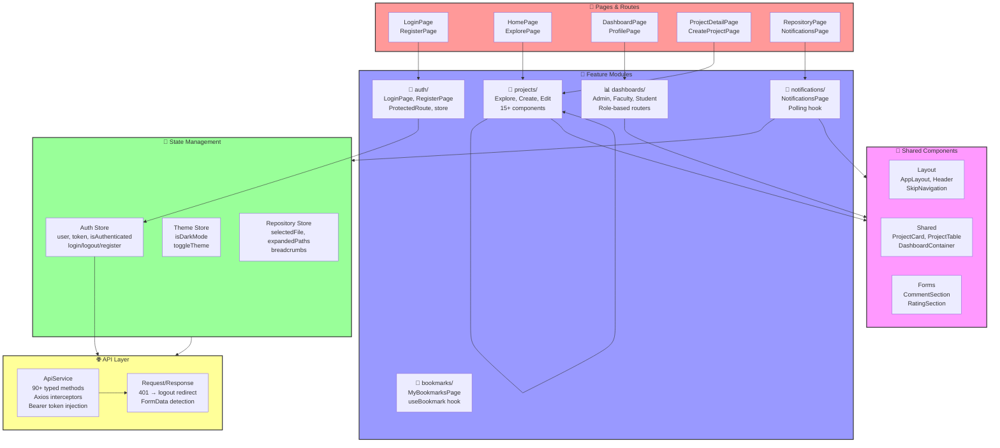

### Backend Architecture Diagram

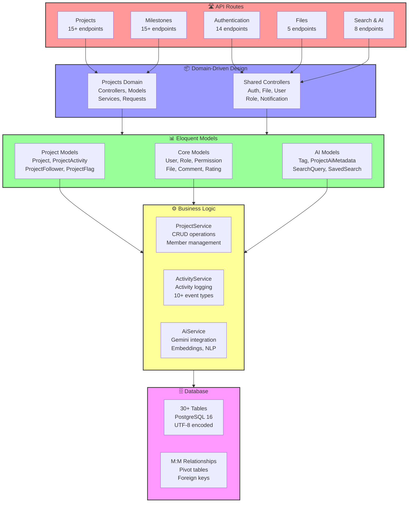

---

## 4. Database Schema (30+ tables, PostgreSQL 16)

### Complete Table List

1. **users** — User authentication, avatars, status (active/inactive/suspended)
2. **roles** — RBAC roles (admin, faculty, student, reviewer)
3. **permissions** — Granular permissions with categories and scopes
4. **role_user** — M:M: users ↔ roles
5. **permission_role** — M:M: roles ↔ permissions (with scope column)
6. **departments** — Academic departments
7. **programs** — Academic programs (degree_level: bachelor/master/phd)
8. **faculty** — Faculty members (department, is_supervisor flag)
9. **students** — Student information (program, cohort_year, student_no)
10. **projects** — Main projects table (slug-based, approval workflow, AI metadata)
11. **project_members** — M:M: projects ↔ users as team members (role_in_project: LEAD/MEMBER)
12. **project_advisors** — M:M: projects ↔ users as advisors (advisor_role: MAIN/CO_ADVISOR/REVIEWER)
13. **files** — Project files with cloud storage paths (public/private visibility)
14. **comments** — Project comments (nested with parent_id for replies)
15. **ratings** — Project ratings (1-5 stars, unique per user per project)
16. **notifications** — User notifications with flexible type and data
17. **bookmarks** — User project bookmarks (unique per user per project)
18. **email_verifications** — Email verification tokens with expiration
19. **milestone_templates** — Reusable milestone templates (program/department scoped)
20. **milestone_template_items** — Template milestone items with permissions
21. **project_milestones** — Project milestones with dependencies and status
22. **project_activities** — Audit log of all project changes (10+ activity types)
23. **project_flags** — Issue flags with severity levels (low/medium/high/critical)
24. **project_followers** — Project followers with notification preferences
25. **tags** — Project tags (manual, ai_generated, system types)
26. **project_tag** — M:M: projects ↔ tags (source, confidence_score)
27. **project_ai_metadata** — AI analysis results (summary, key_concepts, embeddings, complexity_level)
28. **search_queries** — Search analytics (query logs, had_results tracking)
29. **saved_searches** — User saved search queries (with usage_count, last_used_at)
30. **personal_access_tokens** — Sanctum API tokens
31. **password_reset_tokens** — Password reset tokens
32. **sessions** — User sessions (Redis-backed)

### Key Design Decisions

| Pattern | Implementation | Benefit |
|---------|----------------|---------|
| **Slug-based URLs** | 6-char alphanumeric slugs (e.g., `244k3n`) instead of numeric IDs | SEO-friendly, user-readable, backward compatible |
| **JSON Columns** | keywords, custom_members, custom_advisors, dependencies, embedding_vector | Flexibility, denormalization, reduced joins |
| **Pivot Tables with Data** | project_members (role_in_project), project_tag (source, confidence_score), permission_role (scope) | Rich relationship metadata |
| **Audit Trail** | ProjectActivity table logs 10+ activity types with metadata | Complete project history, compliance |
| **Approval Workflow** | admin_approval_status enum (pending, approved, hidden) | Multi-step visibility control |
| **Nested Comments** | comments.parent_id for self-referential foreign key | Threaded discussions |
| **UTF-8 Encoding** | PostgreSQL charset UTF8, Arabic filename support everywhere | Full internationalization |
| **Circular Dependencies** | project_milestones.dependencies JSON array with validation | Flexible but safe workflow graphs |

### Entity-Relationship Overview

```mermaid
erDiagram
    USERS ||--o{ ROLES : have
    USERS ||--o{ PROJECTS : create
    USERS ||--o{ COMMENTS : write
    USERS ||--o{ RATINGS : give
    USERS ||--o{ NOTIFICATIONS : receive
    
    PROJECTS ||--o{ FILES : contain
    PROJECTS ||--o{ COMMENTS : have
    PROJECTS ||--o{ RATINGS : receive
    PROJECTS ||--o{ PROJECT_MILESTONES : track
    PROJECTS ||--o{ PROJECT_ACTIVITIES : log
    PROJECTS ||--o{ PROJECT_FLAGS : report
    PROJECTS ||--o{ BOOKMARKS : bookmarked
    PROJECTS ||--o{ TAGS : tagged
    PROJECTS ||--o{ PROJECT_AI_METADATA : analyze
    
    ROLES ||--o{ PERMISSIONS : grant
    
    MILESTONE_TEMPLATES ||--o{ MILESTONE_TEMPLATE_ITEMS : contain
    MILESTONE_TEMPLATE_ITEMS ||--o{ PROJECT_MILESTONES : map
    
    DEPARTMENTS ||--o{ PROGRAMS : contain
    PROGRAMS ||--o{ STUDENTS : enroll
    DEPARTMENTS ||--o{ FACULTY : employ
    
    SAVED_SEARCHES ||--o{ USERS : belong
    SEARCH_QUERIES ||--o{ USERS : track
    
    USERS: int user_id
    USERS: string full_name
    USERS: string email
    
    PROJECTS: int project_id
    PROJECTS: string slug
    PROJECTS: string title
    PROJECTS: enum status
    PROJECTS: enum approval_status
    
    FILES: int file_id
    FILES: string storage_url
    FILES: boolean is_public
    
    ROLES: int role_id
    ROLES: string name
    ROLES: boolean is_system_role
    
    PERMISSIONS: int permission_id
    PERMISSIONS: string code
    PERMISSIONS: enum category
```

**ASCII Overview**:
```
┌─────────┐     ┌──────────┐     ┌───────────┐
│  Users   │────▶│   Roles  │────▶│Permissions│
│ 19 rels  │ M:M │ + system │ M:M │+categories│
└────┬─────┘     └──────────┘     └───────────┘
     │
     ├──── Faculty (1:1, department)
     ├──── Student (1:1, program)
     │
     ▼
┌──────────────────────────────────────────────────────────┐
│                       PROJECTS                            │
│  slug, title, abstract, keywords(JSON),                  │
│  status, approval_status, custom_members(JSON),          │
│  ai_analysis_enabled, milestone_template_id              │
├──────────────────────────────────────────────────────────┤
│                                                           │
│  Files          Comments (nested)    Ratings (1-5★)     │
│  ├─ S3/MinIO    ├─ threaded replies  ├─ unique/user    │
│  ├─ UUID names  └─ moderation        └─ with reviews   │
│  └─ checksums                                            │
│                                                           │
│  Bookmarks      Notifications        Members & Advisors  │
│  ├─ guest sync  ├─ comment, rating   ├─ custom names   │
│  ├─ DB store    ├─ approval, update  ├─ roles (LEAD,   │
│  └─ unique/user └─ polling           │   MEMBER)       │
│                                       └─ advisor roles  │
│                                                          │
│  Milestones         Activities (Audit)   Flags (Issues) │
│  ├─ dependencies    ├─ 10+ types        ├─ 6 types    │
│  ├─ status track    ├─ metadata JSON    ├─ 4 severities│
│  ├─ due dates       └─ full history     └─ resolution  │
│  └─ templates                                           │
│                                                          │
│  Followers          Tags               AI Metadata      │
│  ├─ notification    ├─ manual          ├─ summary      │
│  │   preferences    ├─ ai_generated    ├─ concepts    │
│  └─ M:M            ├─ system          ├─ embeddings   │
│                    ├─ usage_count     ├─ complexity   │
│                    └─ confidence_score└─ area/subcat  │
└──────────────────────────────────────────────────────────┘

Academic Structure:  Department → Program → Student/Project
Search & Analytics:  SavedSearches, SearchQueries (NLP)
Authentication:      EmailVerifications, PersonalAccessTokens, Sessions
Milestone Workflow:  MilestoneTemplate → MilestoneTemplateItem → ProjectMilestone
```

### Constraints & Indexes

- **Unique Constraints**: email, role.name, permission.code, projects.slug, (user_id, project_id) on bookmarks/ratings, etc.
- **Foreign Key Cascades**: All project/user-related tables cascade on deletion
- **Performance Indexes**: Composite indexes on frequently queried combinations (project_id, created_at), (user_id, is_read), etc.
- **No Soft Deletes**: Hard deletes only — recovery via database backups

---

## 5. Features Matrix

### Authentication & Authorization

| Feature | Detail | Implementation |
|---------|--------|-----------------|
| **User Registration** | Email + password with domain lock | AuthController::register, email domain validation |
| **Email Domain Lock** | Only `@cti.edu.sa` / `@tvtc.edu.sa` | Backend validation in RegisterRequest |
| **Email Verification** | 6-digit OTP or magic link | EmailVerifications table, verify endpoint |
| **Login** | Email/password → Sanctum token | AuthController::login, token persisted in localStorage |
| **Password Reset** | Token-based email flow | forgotPassword → resetPassword endpoints |
| **Multi-Device Login** | Logout all sessions support | logoutAll endpoint, Sanctum multi-token support |
| **RBAC System** | 4 roles × 13 permissions × 4 scopes | Roles, Permissions, PermissionRole pivot with scope |
| **Permission Scopes** | global, department, program, own | PermissionRole.scope column with granular checks |
| **Optional Auth** | Guest + auth on same endpoint | OptionalAuthSanctum middleware |
| **Auto Logout** | 401 → clear token, redirect to login | Axios response interceptor |
| **Token Refresh** | JWT refresh support | refreshToken endpoint |

### Project Management

| Feature | Detail | Implementation |
|---------|--------|-----------------|
| **Project Creation** | 4-step wizard (info → keywords → team → files) | CreateProjectPage with multi-step form |
| **Approval Workflow** | pending → approved / hidden | admin_approval_status enum, approveProject endpoint |
| **Visibility Control** | Public/private toggle | is_public + admin_approval_status columns |
| **Team Members** | Lead + members, custom names | project_members pivot, custom_members JSON |
| **Advisors** | Main + co-advisor + reviewer | project_advisors pivot with advisor_role |
| **File Storage** | Multi-cloud (MinIO, S3, GCS, Azure, Dropbox) | FileController with Flysystem drivers |
| **File Versioning** | UUID filenames, version tracking | files.version column, files.filename vs original_filename |
| **File Checksums** | SHA256 integrity verification | files.checksum column |
| **Project Slugs** | 6-char alphanumeric URLs | projects.slug, auto-generated, route binding |
| **Backward Compatibility** | Numeric ID fallback | Project::resolveRouteBinding supports both slug and ID |

### Discovery & Search

| Feature | Detail | Implementation |
|---------|--------|-----------------|
| **Full-Text Search** | PostgreSQL tsvector on title + abstract | ProjectController::search with `tsvector` |
| **Keyword Search** | JSON array search | JSONB operators @> for keyword matching |
| **Advanced Filters** | Program, department, academic year, semester, status, sort | SearchProjectRequest validation |
| **AI-Powered Search** | Natural language query parsing | AiSearchController::naturalLanguageSearch |
| **Filter Extraction** | NLP → structured filters | Gemini API integration with regex parsing |
| **Similarity Search** | Cosine similarity on embedding vectors | ProjectAiMetadata with embedding_vector, similarity scoring |
| **Saved Searches** | Persist queries with usage tracking | SavedSearch model, recordUsage endpoint |
| **Default Search** | Set preferred saved search | SavedSearch.is_default + setDefault endpoint |
| **Search Autocomplete** | Tag suggestions + research areas | TagController::suggestions endpoint |
| **Search Analytics** | Query logging, failed search tracking | SearchQuery table, failed_searches tracking |

### AI Features

| Feature | Detail | Implementation |
|---------|--------|-----------------|
| **Project Analysis** | Background queued job with Gemini 2.5 Pro | AnalyzeProjectWithAi job, 3 retries with backoff |
| **AI Summary** | Auto-generated project summaries | ProjectAiMetadata.ai_summary |
| **Key Concepts** | Extracted from abstract | ProjectAiMetadata.key_concepts (JSON array) |
| **Research Classification** | Area + subcategories + complexity level | research_area, research_subcategories, complexity_level |
| **Embedding Vectors** | Semantic embeddings for similarity | embedding_vector (JSON array), cosine similarity scoring |
| **AI Tags** | Auto-generated with confidence scores | Tag.type = ai_generated, project_tag.confidence_score |
| **Tag Suggestions** | Manual + AI auto-suggestions | TagController with auto/manual source types |
| **NLP Search** | Natural language → SQL filters | Query parsing, filter extraction, dynamic query building |
| **AI Timeout Handling** | Fallback on timeout/error | try-catch with fallback mode in AiAnalysisService |
| **Model Versioning** | Track AI model used | ProjectAiMetadata.ai_model_version for future transitions |

### Project Tracking (Follow System)

| Feature | Detail | Implementation |
|---------|--------|-----------------|
| **Milestone Timeline** | Visual timeline with status + dependencies | ProjectMilestone with status, due_date, dependencies JSON |
| **Milestone Dependencies** | Circular dependency detection | Validation in ProjectMilestone::canStart() |
| **Milestone Templates** | Reusable (e.g., 10-step Graduate Program) | MilestoneTemplate + MilestoneTemplateItem |
| **Template Application** | Apply to project on creation | applyTemplateToProject endpoint |
| **Activity Feed** | Audit log of all changes (10+ types) | ProjectActivity with activity_type, metadata JSON |
| **Project Health Score** | Composite metric (activity, milestones, timeliness, engagement, files) | Calculated on ProjectFollowPage |
| **Issue Flags** | 6 types × 4 severities × resolution tracking | ProjectFlag with flag_type, severity, resolved_at |
| **Confidential Flags** | Only visible to admins/advisors | ProjectFlag.is_confidential column |
| **Followers** | Follow with custom notification preferences | ProjectFollower with notification_preferences JSON |
| **Follow Notifications** | Custom preferences per follower | notificationService with preference checks |

### Engagement

| Feature | Detail | Implementation |
|---------|--------|-----------------|
| **Comments** | Nested/threaded replies, moderation | Comment.parent_id for nesting, is_approved for moderation |
| **Nested Replies** | Reply to any comment | Comment relationships: replies() HasMany |
| **Ratings** | 1-5 stars with optional reviews | Rating validation in setRatingAttribute (1-5 range) |
| **One Rating per User** | Unique constraint on (project_id, user_id) | Unique constraint in database |
| **Bookmarks** | Auth DB + guest cookies, auto-sync on login | Guest: browser cookies, Auth: database, sync on login |
| **Guest Bookmarks** | Persist across sessions | bookmarkCookies util with guest-bookmarks key |
| **Bookmark Sync** | Guest → Auth on login/register | syncGuestBookmarks endpoint, useAuthStore |
| **Notifications** | In-app with polling (not WebSocket) | useNotifications hook with setInterval polling |
| **Notification Types** | comment, rating, evaluation, approval, update, etc. | Notification.type enum-like string field |
| **Unread Count** | Unread notification badge | NotificationController::unreadCount, is_read column |
| **Command Palette** | Cmd+K quick navigation | CommandPalette component with cmdk library |

### Repository Viewer

| Feature | Detail | Implementation |
|---------|--------|-----------------|
| **GitHub-like UI** | File tree browser + content viewer | FileBrowser + FileContentViewer components |
| **File Tree** | Hierarchical folder/file structure | Normalized file tree in repositoryStore |
| **Expand/Collapse** | Toggle folders | toggleExpand, expandPath, collapsePath actions |
| **Syntax Highlighting** | Code files with line numbers | Prism or highlight.js integration |
| **Breadcrumb Navigation** | Path-aware navigation | Breadcrumb component synced with URL |
| **File Actions** | Download, copy to clipboard | File menu with download + copy buttons |
| **File Metadata** | Size, type, upload date | File model with mime_type, size_bytes, uploaded_at |

---

## 6. UX Flow — User Journeys

### Authentication Flow Diagram

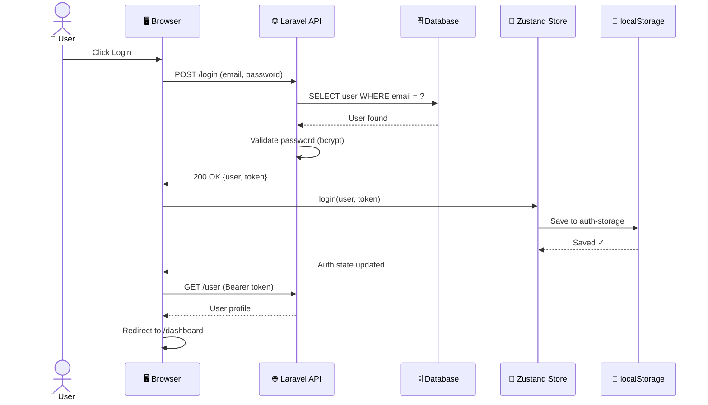

### Guest → Auth Transition Diagram

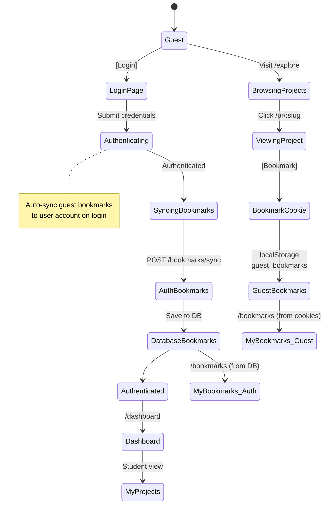

### 6.1 Guest Journey

```mermaid
graph LR
    A["🏠 Landing<br/>Home Page"] --> B["🔍 Explore<br/>Browse Projects"]
    B --> C["📖 View Detail<br/>/pr/:slug"]
    C --> D["📌 Bookmark<br/>Stored in Cookie"]
    D --> E["📚 My Bookmarks<br/>Read from Cookie"]
    E --> F["🔐 Login<br>/login"]
    F --> G["✅ Authenticated<br/>Token in localStorage"]
    G --> H["🔄 Sync Bookmarks<br/>Cookie → Database"]
    H --> I["📚 My Bookmarks<br/>Read from Database"]
    
    style A fill:#99ff99
    style B fill:#99ff99
    style C fill:#99ff99
    style D fill:#ffff99
    style E fill:#ffff99
    style F fill:#ff9999
    style G fill:#99ccff
    style H fill:#99ccff
    style I fill:#99ccff
```

**Key Features**:
- No login required to explore projects
- Bookmarks stored in cookies (persist across sessions)
- Auto-sync to user account on login
- Guest → Auth smooth transition

### 6.2 Student Journey

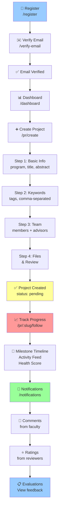

### 6.3 Faculty Journey

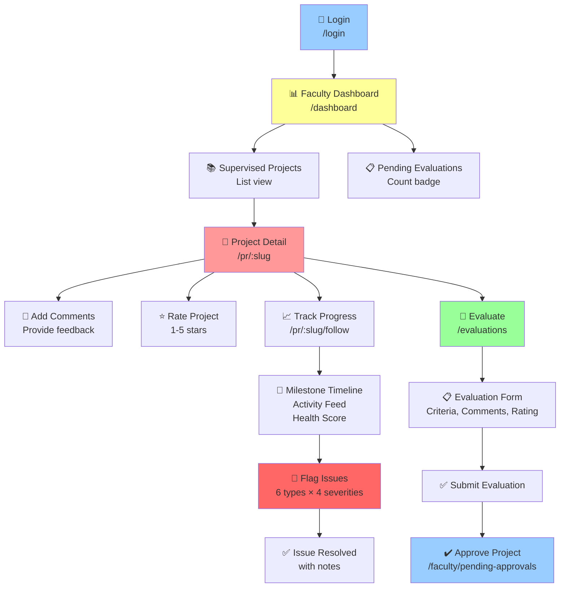

### 6.4 Admin Journey

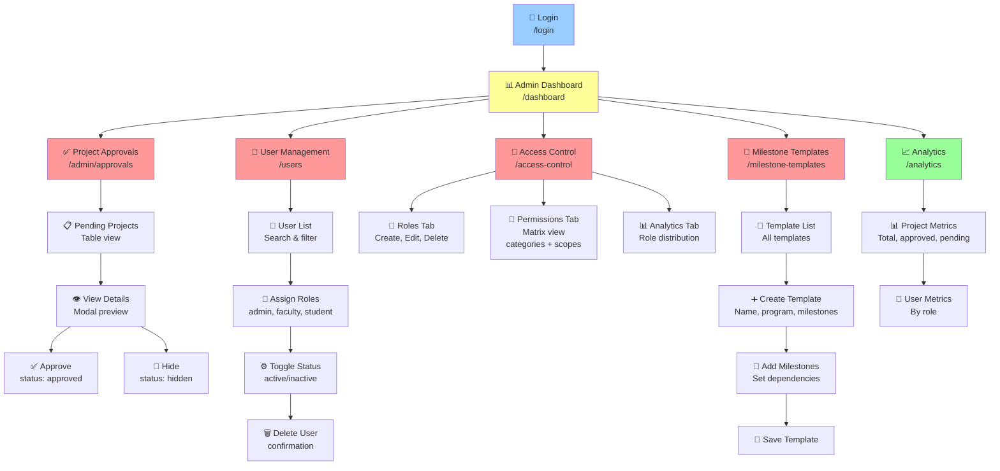

### Project Lifecycle Diagram

```mermaid
graph LR
    A["📝 Draft<br/>Created by Student"] -->|[Submit]| B["🔄 Under Review<br/>Faculty Review"]
    B -->|[Approve]| C["✅ Approved<br/>Visible to All"]
    B -->|[Reject]| D["❌ Rejected<br/>Needs Revision"]
    D -->|[Resubmit]| B
    C -->|[Track]| E["📈 In Progress<br/>Milestones Active"]
    E -->|[Complete]| F["🏆 Completed<br/>Project Archived"]
    C -->|[Hide]| G["🚫 Hidden<br/>Admin Action"]
    
    H["📋 Pending Approval<br/>Admin Gate"] -->|[Admin Approve]| C
    H -->|[Admin Hide]| G
    
    style A fill:#ffcccc
    style B fill:#ffff99
    style C fill:#99ff99
    style D fill:#ff9999
    style E fill:#99ccff
    style F fill:#99ff99
    style G fill:#999999
    style H fill:#ffff99
```

### Approval Workflow Diagram

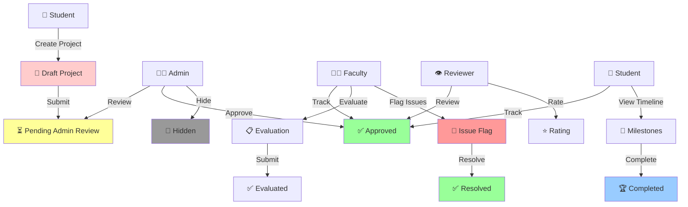

---

```
Login (/login)
  ↓ Faculty Dashboard (/dashboard)
Faculty Dashboard
  ├─ Supervised Projects (list)
  ├─ Pending Evaluations (count)
  ├─ Recent Activity
  └─ Quick Actions
  ↓ [View Project]
Project Detail (/pr/:slug)
  ├─ Title, abstract, team, files
  ├─ Comments (add feedback)
  └─ Ratings (1-5★)
  ↓ [Track Progress]
Project Follow (/pr/:slug/follow)
  ├─ Milestone Timeline
  ├─ Activity Feed
  ├─ Health Score
  ├─ [Flag Issue] ← Critical feature
  └─ Followers
  ↓ [Evaluate]
Evaluations Page (/evaluations)
  ├─ Projects to evaluate
  ├─ Evaluation form (criteria, comments, rating)
  └─ [Submit Evaluation]
  ↓ [Approve Project]
Faculty Pending Approvals (/faculty/pending-approvals)
  ├─ Projects awaiting approval
  └─ [Approve/Reject]
```

### 6.4 Admin Journey

```
Login (/login)
  ↓ Admin Dashboard (/dashboard)
Admin Dashboard
  ├─ System Overview (total projects, pending, approved)
  ├─ Quick Actions
  │  ├─ [Project Approvals]
  │  ├─ [User Management]
  │  ├─ [Access Control]
  │  └─ [Milestone Templates]
  └─ Recent Activity
  ↓ [Approve Projects]
Project Approvals (/admin/approvals)
  ├─ Pending projects (table/list)
  ├─ Filters (program, department, date)
  ├─ [View] → Project detail modal
  ├─ [Approve] → status: approved
  └─ [Hide] → status: hidden
  ↓ [Manage Users]
User Management (/users)
  ├─ User list with search
  ├─ Assign roles
  ├─ Toggle status (active/inactive)
  └─ [Delete User]
  ↓ [Manage Roles]
Access Control (/access-control)
  ├─ Roles tab (create, edit, delete)
  ├─ Permission selector (category + scope)
  ├─ Users tab (assign roles)
  ├─ Permissions tab (matrix view)
  └─ Analytics tab (role distribution)
  ↓ [Configure Milestones]
Milestone Templates (/milestone-templates)
  ├─ Template list
  ├─ [Create Template]
  ├─ Template form (name, program, milestones)
  ├─ Add/remove milestones
  ├─ Set dependencies
  └─ [Save Template]
  ↓ [View Analytics]
Analytics Page (/analytics)
  ├─ Project metrics
  ├─ User metrics
  ├─ Rating distribution
  └─ Activity trends
```

### 6.5 Route Protection Model

| Route Type | Guard | Example |
|------------|-------|---------|
| **Public** | None | `/explore`, `/pr/:slug`, `/bookmarks` |
| **Auth Required** | `ProtectedRoute` | `/dashboard`, `/notifications`, `/profile`, `/pr/:slug/follow`, `/pr/:slug/code` |
| **Role-Gated** | `RoleProtectedRoute` | `/admin/approvals` (admin), `/evaluations` (faculty), `/access-control` (admin) |
| **Restricted** | `restrictedRoles: ['reviewer']` | `/pr/create` blocks reviewer role |
| **Legacy Redirect** | Redirect | `/projects/:id` → `/pr/:id` |

### 6.6 Role-Based Dashboards

| Role | Dashboard | Key Stats | Primary Actions |
|------|-----------|-----------|-----------------|
| **Student** | StudentDashboard | My projects, in progress, completed, pending | Create project, edit, track, view evaluations |
| **Faculty** | FacultyDashboard | Supervised projects, pending evaluations, recent activity | Supervise, evaluate, approve, flag issues |
| **Admin** | AdminDashboard | Total projects, pending approvals, approved, system health | Approve, manage users, manage roles, analytics |
| **Reviewer** | ReviewerDashboard | Projects to review, completed reviews, pending | Review, comment, rate (read-mostly) |

### Role-Based Access Control (RBAC) Diagram

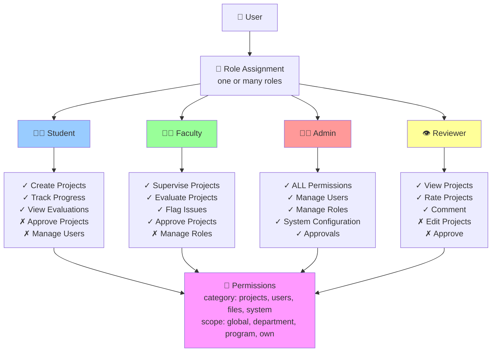

### Permission Scopes Diagram

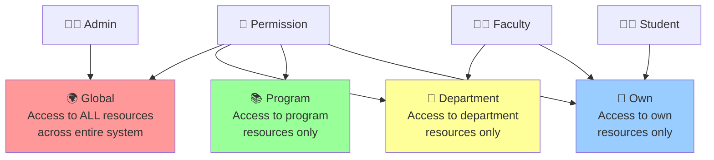

---

## 7. API Endpoints (100+)

### API Endpoints Categories Diagram

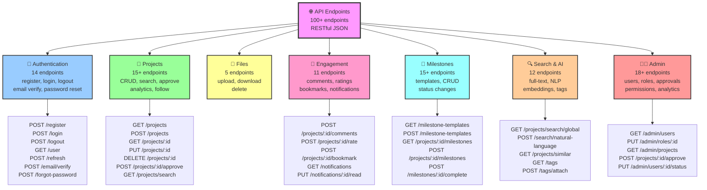

### Authentication (14 endpoints)

```
POST /register                              Register user
POST /login                                 Login user
POST /logout                                Logout current session
POST /logout-all                            Logout all sessions
GET  /user                                  Get current user
POST /refresh                               Refresh token
POST /email/send-verification               Send email verification
POST /email/verify                          Verify email with code
GET  /email/verify-magic/:token             Verify via magic link
POST /email/resend-verification             Resend verification email
POST /forgot-password                       Initiate password reset
POST /reset-password                        Reset password with token
POST /change-password                       Change password (authenticated)
PUT  /profile                               Update profile
```

### Projects (15+ endpoints)

```
GET  /projects                              List projects (with filters, pagination)
GET  /projects/search/global                Advanced search with NLP
GET  /projects/suggestions                  Autocomplete suggestions
GET  /projects/analytics                    Project analytics
POST /projects                              Create project
GET  /projects/:id                          Get project detail
PUT  /projects/:id                          Update project
DELETE /projects/:id                        Delete project
POST /projects/:id/approve                  Admin: approve project
POST /projects/:id/hide                     Admin: hide project
POST /projects/:id/toggle-visibility        Toggle visibility
GET  /admin/projects                        Admin: list all projects
GET  /admin/projects/pending                Admin: pending approvals
```

### Files (5 endpoints)

```
POST /projects/:id/files                    Upload file
GET  /projects/:id/files                    List project files
GET  /files/:id/download                    Download file
DELETE /files/:id                           Delete file
```

### Comments & Ratings (6 endpoints)

```
GET  /projects/:id/comments                 Get comments
POST /projects/:id/comments                 Add comment
GET  /projects/:id/ratings                  Get ratings
POST /projects/:id/rate                     Rate project
```

### Bookmarks (5 endpoints)

```
POST /projects/:id/bookmark                 Bookmark project
DELETE /projects/:id/bookmark               Unbookmark project
GET  /projects/:id/is-bookmarked            Check if bookmarked
GET  /projects/bookmarked                   Get user's bookmarks
POST /bookmarks/sync                        Sync guest bookmarks on login
```

### Project Follow (8 endpoints)

```
GET  /projects/:id/activities               Get activity feed
GET  /projects/:id/activities/timeline      Get timeline
POST /projects/:id/follow                   Follow project
DELETE /projects/:id/follow                 Unfollow project
GET  /projects/:id/followers                Get followers
POST /projects/:id/flags                    Create flag
PUT  /flags/:id/resolve                     Resolve flag
GET  /projects/:id/flags                    Get flags
```

### Milestones (15+ endpoints)

```
GET  /projects/:id/milestones               Get milestones
POST /projects/:id/milestones               Create milestone
PUT  /milestones/:id                        Update milestone
DELETE /milestones/:id                      Delete milestone
POST /milestones/:id/start                  Start milestone
POST /milestones/:id/complete               Complete milestone
POST /milestones/:id/reopen                 Reopen milestone
PUT  /milestones/:id/due-date               Update due date
GET  /projects/:id/milestones/timeline      Get timeline
GET  /milestone-templates                   List templates
POST /milestone-templates                   Create template
GET  /milestone-templates/:id               Get template
PUT  /milestone-templates/:id               Update template
DELETE /milestone-templates/:id             Delete template
POST /milestone-templates/:id/apply-to-project  Apply template
```

### Notifications (6 endpoints)

```
GET  /notifications                         List notifications
GET  /notifications/unread-count            Get unread count
PUT  /notifications/:id/read                Mark as read
PUT  /notifications/read-all                Mark all as read
DELETE /notifications/:id                   Delete notification
DELETE /notifications                       Delete all notifications
```

### Tags (8 endpoints)

```
GET  /tags                                  List tags
GET  /tags/popular                          Popular tags
GET  /tags/ai-generated                     AI-generated tags
GET  /tags/suggestions                      Tag suggestions
POST /projects/:id/tags                     Attach tags
DELETE /projects/:id/tags/:tag              Detach tag
POST /projects/:id/tags/sync                Sync tags
```

### AI Search (4 endpoints)

```
POST /projects/:id/analyze                  Trigger AI analysis
GET  /projects/:id/metadata                 Get AI metadata
GET  /projects/similar                      Find similar projects
POST /search/natural-language               Natural language search
```

### Saved Searches (6 endpoints)

```
GET  /saved-searches                        List saved searches
POST /saved-searches                        Create saved search
GET  /saved-searches/:id                    Get saved search
PUT  /saved-searches/:id                    Update saved search
DELETE /saved-searches/:id                  Delete saved search
POST /saved-searches/:id/use                Record usage
```

### User Management (8 endpoints)

```
GET  /users                                 List users
GET  /admin/users                           Admin: list users
POST /admin/users                           Admin: create user
PUT  /admin/users/:id                       Admin: update user
DELETE /admin/users/:id                     Admin: delete user
PUT  /admin/users/:id/status                Admin: toggle status
```

### Roles & Permissions (6 endpoints)

```
GET  /roles                                 List roles
GET  /permissions                           List permissions
POST /admin/roles                           Create role
PUT  /admin/roles/:id                       Update role
DELETE /admin/roles/:id                     Delete role
```

### Academic Structure (2 endpoints)

```
GET  /programs                              List programs
GET  /departments                           List departments
```

---

## 8. State Management

### Zustand Stores Data Flow Diagram

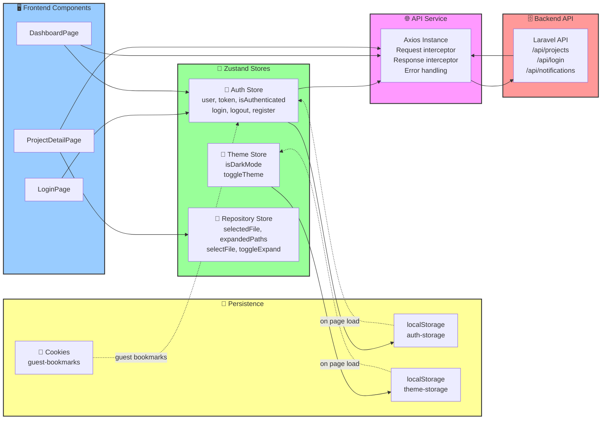

### Zustand Stores

#### Auth Store (`features/auth/store.ts`)

```typescript
useAuthStore {
  // State
  user: User | null
  token: string | null
  isAuthenticated: boolean
  isLoading: boolean
  error: string | null
  
  // Actions
  login(credentials)           // Email + password
  register(data)               // Full name, email, password
  logout()                     // Clear all auth data
  refreshToken()               // Refresh JWT
  setUser(user)                // Manual setter
  setToken(token)              // Manual setter
  setAuthenticated(bool)       // Manual setter
  setLoading(bool)             // Manual setter
  setError(error)              // Manual setter
  clearError()                 // Clear error message
  
  // Features
  - Guest bookmark sync on login/register
  - Persist to localStorage (auth-storage)
  - Axios interceptor auto-injects token
}
```

#### Theme Store (`store/themeStore.ts`)

```typescript
useThemeStore {
  // State
  isDarkMode: boolean
  
  // Actions
  toggleDarkMode()             // Toggle light/dark
  setTheme(mode)               // Set specific mode
  
  // Features
  - Persist to localStorage (theme-storage)
}
```

#### Repository Store (`store/repositoryStore.ts`)

```typescript
useRepositoryStore {
  // State
  selectedFilePath: string | null
  expandedPaths: string[]
  breadcrumbs: string[]
  
  // Actions
  selectFile(path)             // Select file
  toggleExpand(path)           // Expand/collapse folder
  
  // Features
  - In-memory only (no persistence)
  - Syncs with URL and URL params
}
```

---

## 9. API Integration

### Axios Configuration (`lib/api.ts`)

```typescript
// Request Interceptor
- Reads token from localStorage (auth-storage)
- Injects Bearer token in Authorization header
- Skips Content-Type for FormData (file uploads)

// Response Interceptor
- 401 Unauthorized: Clear auth state, redirect to /login (except public pages)
- 422 Unprocessable: Return validation errors to caller
- 500 Server Error: Log error, return to caller
- Network Error: Return meaningful error

// Error Handling
- Fallback empty arrays/objects on error
- Detailed error logging for debugging
```

---

## 10. Security Features

| Feature | Implementation |
|---------|-----------------|
| **Password Hashing** | 12-round bcrypt |
| **Token Auth** | Laravel Sanctum with Bearer tokens |
| **HTTPS Ready** | Production Nginx with SSL headers |
| **CORS** | Configured for API + Sanctum CSRF |
| **Security Headers** | X-Frame-Options, X-XSS-Protection, CSP |
| **Email Domain Lock** | Only institutional emails allowed |
| **401 Auto-Logout** | Automatic redirect on token expiry |
| **Session Management** | Redis-backed sessions, Sanctum tokens |
| **RBAC** | Fine-grained role-based access control |
| **Input Validation** | Client + server-side validation |
| **XSS Prevention** | React escapes content by default |
| **CSRF Protection** | Sanctum CSRF tokens for SPA |

---

## 11. Performance Optimizations

| Technique | Implementation |
|-----------|-----------------|
| **Virtualization** | react-window for 1000+ project grids |
| **Code Splitting** | Route-based lazy loading (React Router) |
| **Vendor Chunks** | Separate bundles: vendor, mui, app |
| **Redis Caching** | Cache, sessions, queues (LRU 256MB) |
| **Gzip Compression** | Nginx gzip on text/JSON/JavaScript |
| **Database Indexes** | Composite indexes on frequently queried columns |
| **Query Optimization** | Eager loading relationships, efficient filters |
| **Pagination** | API pagination with per_page parameter |
| **Skeleton Loaders** | UX improvement during data load |
| **Lazy Image Loading** | Images lazy-loaded on demand |
| **Connection Pooling** | PostgreSQL connection management |

---

## 12. Internationalization (i18n)

### Language Support

```
English (en)    LTR, default
Arabic (ar)     RTL
Other languages (extensible)
```

### Implementation

```typescript
// Language Context
useLanguage() hook provides:
  - language: 'en' | 'ar'
  - t(text, replacements) → translated text
  - setLanguage(lang) → change language
  - toggleLanguage() → switch EN ↔ AR

// RTL Support
- Emotion CSS-in-JS cache with stylis-plugin-rtl
- Material-UI RTL-aware components
- Flexbox layouts (automatic direction switching)
- Margin/padding adjustments

// Translation Maps
- translations.ts with EN ↔ AR mappings
- Reverse map for bidirectional translation
- Text normalization (spacing, punctuation)
```

---

## 13. Accessibility (WCAG AA)

| Feature | Implementation |
|---------|-----------------|
| **Keyboard Navigation** | Arrow keys, Tab, Enter, Space, Escape |
| **Skip Links** | Skip to main content, Skip navigation |
| **ARIA Labels** | Semantic labels on all interactive elements |
| **Screen Reader** | Announcements for actions, status updates |
| **Focus Management** | Focus trap in modals, visible focus indicators |
| **Color Contrast** | AA compliance (4.5:1 for text) |
| **Font Sizes** | Readable sizes (16px minimum) |
| **Reduced Motion** | Respects `prefers-reduced-motion` |
| **Form Labels** | Associated labels on all inputs |
| **Semantic HTML** | Proper heading hierarchy, semantic elements |
| **Error Messages** | Clear, actionable error text near inputs |

---

## 14. Error Handling

### Frontend

```typescript
// Component-Level
- ErrorBoundary catches React errors
- Graceful fallback UI

// API-Level
- Axios interceptor handles 401, 422, 500
- Detailed error logging
- User-friendly error messages

// Validation
- Real-time form validation
- Server error display in forms
- Toast notifications for errors

// Fallback Values
- Empty arrays instead of null
- Default objects for missing data
- Optional chaining throughout
```

### Backend

```php
// Exception Handling
- Laravel exception handler
- Structured error responses
- Detailed logging

// Validation
- Form Requests with detailed rules
- Custom validation messages
- Constraint violations from database
```

---

## 15. Testing

### Backend (PHPUnit)

```
tests/
├── Feature/
│   ├── AuthTest.php (login, register, password reset)
│   ├── ProjectTest.php (CRUD, approval, search)
│   ├── FileTest.php (upload, download)
│   ├── AiAnalysisTest.php (AI integration)
│   └── MilestoneTest.php (templates, dependencies)
└── Unit/
    ├── ProjectServiceTest.php
    ├── AiAnalysisServiceTest.php
    └── PermissionServiceTest.php
```

### Frontend (Jest + React Testing Library)

```
web/src/__tests__/
├── features/
│   ├── auth/ (login, register flows)
│   ├── projects/ (create, edit, search)
│   └── dashboards/ (role-based rendering)
└── components/ (component isolation tests)
```

---

## 15.5 Feature Modules Architecture Diagram

```mermaid
graph TB
    subgraph Auth["🔐 Auth Module"]
        AuthPages["Pages:<br/>LoginPage<br/>RegisterPage<br/>EmailVerificationPage<br/>ForgotPasswordPage"]
        AuthComponents["Components:<br/>ProtectedRoute<br/>RoleProtectedRoute<br/>ChangePasswordForm"]
        AuthStore["Store:<br/>useAuthStore<br/>user, token, isAuthenticated<br/>login, logout, register"]
    end
    
    subgraph Projects["🎨 Projects Module"]
        ProjectPages["Pages:<br/>ExplorePage<br/>CreateProjectPage<br/>EditProjectPage<br/>ProjectDetailPage"]
        ProjectComps["Components:<br/>ProjectCard<br/>ProjectTable<br/>ProjectFiles<br/>ProjectForm (15+ components)"]
    end
    
    subgraph Dashboards["📊 Dashboards Module"]
        DashPages["Pages:<br/>DashboardPage (router)"]
        DashComps["Components:<br/>AdminDashboard<br/>FacultyDashboard<br/>StudentDashboard<br/>ReviewerDashboard"]
    end
    
    subgraph Bookmarks["📌 Bookmarks Module"]
        BookmarkPages["Pages:<br/>MyBookmarksPage"]
        BookmarkHooks["Hooks:<br/>useBookmark<br/>handles guest + auth"]
    end
    
    subgraph Repository["💻 Repository Module"]
        RepositoryPages["Pages:<br/>RepositoryPage"]
        RepositoryComps["Components:<br/>FileBrowser<br/>FileContentViewer<br/>RepositoryLayout"]
    end
    
    subgraph Follow["📈 Project Follow Module"]
        FollowPages["Pages:<br/>ProjectFollowPage"]
        FollowComps["Components:<br/>MilestoneTimeline<br/>ActivityFeed<br/>ProjectFlags<br/>ProjectFollowers"]
    end
    
    subgraph Notifications["🔔 Notifications Module"]
        NotifPages["Pages:<br/>NotificationsPage"]
        NotifHooks["Hooks:<br/>useNotifications<br/>auto-polling"]
    end
    
    subgraph AccessControl["🔑 Access Control Module"]
        ACPages["Pages:<br/>AccessControlPage"]
        ACComps["Components:<br/>RolesTab<br/>PermissionsTab<br/>UsersTab<br/>AnalyticsTab"]
    end
    
    subgraph Milestones["📅 Milestones Module"]
        MilestonePages["Pages:<br/>MilestoneTemplateConfigPage"]
        MilestoneComps["Components:<br/>TemplateList<br/>TemplateEditor<br/>ProgramTemplateSelector"]
    end
    
    App["🖥️ App.tsx<br/>Root Component"]
    
    App --> Auth
    App --> Projects
    App --> Dashboards
    App --> Bookmarks
    App --> Repository
    App --> Follow
    App --> Notifications
    App --> AccessControl
    App --> Milestones
    
    Auth --> AuthStore
    Projects --> APIService["📡 API Service<br/>90+ endpoints"]
    Dashboards --> APIService
    Bookmarks --> APIService
    Repository --> APIService
    Follow --> APIService
    
    AuthPages --> AuthComponents
    AuthComponents --> AuthStore
    
    ProjectPages --> ProjectComps
    DashPages --> DashComps
    FollowPages --> FollowComps
    
    style Auth fill:#99ccff,stroke:#333,stroke-width:2px
    style Projects fill:#99ff99,stroke:#333,stroke-width:2px
    style Dashboards fill:#ffff99,stroke:#333,stroke-width:2px
    style Bookmarks fill:#ff99cc,stroke:#333,stroke-width:2px
    style Repository fill:#99ffff,stroke:#333,stroke-width:2px
    style Follow fill:#ffcc99,stroke:#333,stroke-width:2px
    style Notifications fill:#ccccff,stroke:#333,stroke-width:2px
    style AccessControl fill:#ff9999,stroke:#333,stroke-width:2px
    style Milestones fill:#99ff99,stroke:#333,stroke-width:2px
    style App fill:#ff99ff,stroke:#333,stroke-width:3px
    style APIService fill:#ffff99,stroke:#333,stroke-width:3px
```

---

## 16. Deployment & Environment

### Deployment Architecture Diagram

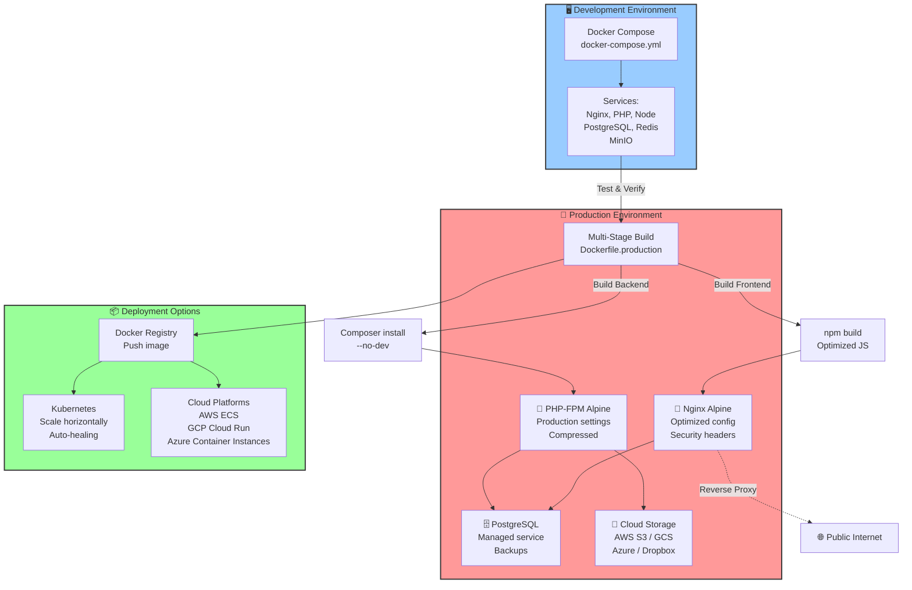

### Development

```bash
# Docker Compose
docker compose up -d

# Services start automatically
- Laravel migrations + seeding
- MinIO bucket creation
- React dev server with HMR

# Access
- Frontend: http://localhost:3000
- API: http://localhost/api
- MinIO Console: http://localhost:9001
- PostgreSQL: localhost:5433
```

### Production

```dockerfile
# Multi-stage Docker build
Stage 1: Node frontend build
  - npm install
  - npm run build → build/ directory

Stage 2: PHP backend
  - Composer install --no-dev
  - Copy built frontend to /var/www/html/public/build

Stage 3: Production image
  - Alpine base
  - PHP 8.3 FPM + extensions
  - Nginx + config
  - Final layer: 200-300MB
```

### Environment Variables

**Backend** (`api/.env`)
```
APP_NAME=Fahras
APP_ENV=production
APP_DEBUG=false
APP_KEY=base64:...
APP_URL=https://app.saudiflux.org
APP_TIMEZONE=Asia/Riyadh

DB_CONNECTION=pgsql
DB_HOST=db
DB_PORT=5432
DB_DATABASE=fahras
DB_USERNAME=fahras
DB_PASSWORD=...

REDIS_HOST=redis
REDIS_PORT=6379

FILESYSTEM_DISK=s3
AWS_ACCESS_KEY_ID=...
AWS_SECRET_ACCESS_KEY=...
AWS_BUCKET=fahras-files
AWS_ENDPOINT=...

AI_PROVIDER=gemini
AI_ENABLED=true
GEMINI_API_KEY=...
GEMINI_MODEL=gemini-2.5-pro
```

**Frontend** (`web/.env`)
```
VITE_API_URL=http://localhost/api
VITE_APP_NAME=Fahras
```

---

## 17. Architecture Assessment

### Strengths

✅ **Clean Separation**: DDD backend + feature-based frontend  
✅ **Type Safety**: Full TypeScript on frontend, Form Requests on backend  
✅ **Multi-Cloud Storage**: Abstracted via Flysystem  
✅ **AI Integration**: Embedding-based similarity, NLP search, auto-tagging  
✅ **Elegant Guest Experience**: Cookie bookmarks → DB sync on login  
✅ **Comprehensive Audit Trail**: Every change logged with metadata  
✅ **Role Flexibility**: Scoped permissions (global/department/program/own)  
✅ **Production-Ready Docker**: Multi-stage builds, health checks, resource limits  
✅ **Accessibility**: WCAG AA compliance throughout  
✅ **Internationalization**: Full EN/AR support with RTL  

### Areas to Watch

⚠️ **Notification Polling**: Uses polling instead of WebSocket (acceptable for this scale, but can be optimized)  
⚠️ **Hard Deletes Only**: No soft deletes — recovery requires database backups  
⚠️ **Monolithic API**: Single routes file with 100+ endpoints (could split by feature)  
⚠️ **JSON Columns**: Heavy use of JSON (keywords, members, advisors) — querying slower than normalized tables  
⚠️ **AI Dependency**: Gemini API coupling — needs fallback strategy (has `fallback` mode configured)  
⚠️ **No API Versioning**: Single /api version (future breaking changes need strategy)  

### Scale Profile

This is a **department/college-scale system**:
- **Designed for**: 100s of concurrent users, 1000s of projects
- **Not suitable for**: Millions of users, real-time streaming
- **Scaling path**: PostgreSQL replication, Redis cluster, horizontal API scaling via load balancer

---

## 18. Key Implementation Highlights

### Slug-Based URLs
- 6-char alphanumeric slugs instead of numeric IDs
- Auto-generated on project creation
- SEO-friendly and user-readable
- Backward compatible with numeric ID fallback

### Guest → Auth Transition
- Cookie-based bookmarks for guests
- Auto-sync to database on login/register
- Seamless experience without forcing login upfront

### Approval Workflow
- Multiple approval statuses: pending, approved, hidden
- Admin notes tracking
- Activity logging at each step

### Milestone Dependencies
- Circular dependency detection
- Visual timeline with progress
- Status tracking: pending, in-progress, blocked, completed

### AI-Powered Features
- Background job processing with retries
- Embedding vectors for similarity search
- Natural language query parsing
- Auto-tagging with confidence scores

### Project Activity Audit Trail
- 10+ activity types logged
- Metadata JSON for rich context
- Complete project history

---

## 19. Development Workflow

### Common Commands

```bash
# Backend
docker compose exec php php artisan migrate:fresh --seed
docker compose exec php php artisan test
docker compose exec php ./vendor/bin/pint

# Frontend
docker compose exec node npm install
docker compose exec node npm run lint -- --fix
docker compose exec node npm test

# View logs
docker compose logs -f php
docker compose logs -f node
docker compose logs -f db
```

---

## 20. Repository Structure

```
Fahras/
├── api/                      Laravel backend
├── web/                      React frontend
├── docker-compose.yml        Service orchestration
├── .docker/                  Docker configurations
│   ├── nginx/
│   ├── api/
│   └── Dockerfile.production
├── README.md                 Project documentation
└── CLAUDE.md                 AI assistant guidance
```

---

## 21. Conclusion

**Fahras** is a well-architected, production-ready graduation project archiving system combining:

- **Modern Backend**: Laravel 11 with DDD, Sanctum auth, PostgreSQL
- **Modern Frontend**: React 19, TypeScript, Material-UI v7, Zustand
- **AI Features**: Gemini integration with embeddings and NLP
- **Multi-Stakeholder Workflows**: Students, faculty, admins, reviewers
- **Comprehensive Features**: Projects, files, comments, ratings, milestones, bookmarks, notifications, search, analytics
- **Security & Accessibility**: RBAC, WCAG AA, i18n (EN/AR)
- **Production Deployment**: Docker Compose with health checks, resource limits

The system is ready for:
- College/university deployment
- Scaling to support hundreds of concurrent users
- Integration with institutional systems
- Custom branding and customization

---

## 22. Complete Data Flow Example: Create & Share Project

```mermaid
sequenceDiagram
    actor Student as 👨‍🎓 Student
    participant Frontend as 🖥️ React Frontend
    participant Store as 🏪 Zustand Store
    participant API as 🌐 API Service
    participant Backend as 🐘 Laravel API
    participant DB as 🗄️ PostgreSQL
    participant Storage as 💾 MinIO/S3
    participant Faculty as 👨‍🏫 Faculty

    Student->>Frontend: Click Create Project
    Frontend->>Store: Fill form (info, files, team)
    Store->>Store: Validate form
    Student->>Frontend: [Submit]
    
    Frontend->>API: POST /projects (FormData)
    API->>API: Add Bearer token
    API->>Backend: Send request
    
    Backend->>DB: START TRANSACTION
    Backend->>DB: INSERT projects (pending status)
    DB-->>Backend: Return project_id
    Backend->>DB: INSERT project_members
    Backend->>DB: INSERT project_activities (logged)
    
    Frontend->>Storage: Upload files (S3/MinIO)
    Storage-->>Frontend: Return storage_url
    
    Backend->>DB: INSERT files (with storage_url)
    Backend->>DB: COMMIT TRANSACTION
    DB-->>Backend: Success
    
    Backend-->>API: 201 Created {project}
    API-->>Frontend: Response with project data
    
    Store->>Store: Update state (redirect)
    Frontend->>Frontend: Redirect to /pr/:slug
    Frontend-->>Student: Success message
    
    Backend->>DB: CREATE notification
    DB-->>Backend: Notification created
    Backend->>Backend: Dispatch AnalyzeProjectWithAi job
    Backend->>Backend: Queue job (Redis)
    
    Note over Backend,Storage: Background Job
    Backend->>Backend: Analyze with Gemini AI
    Backend->>DB: INSERT project_ai_metadata
    Backend->>DB: INSERT tags (ai_generated)
    Backend->>DB: UPDATE project (ai_analysis_completed)
    
    Faculty->>Frontend: Visit /notifications
    Frontend->>API: GET /notifications
    API->>Backend: Fetch notifications
    Backend->>DB: SELECT notifications WHERE user_id = ?
    DB-->>Backend: Notifications
    Backend-->>API: Response
    API-->>Frontend: Render notifications
    
    Faculty->>Frontend: Click notification
    Frontend->>Frontend: Navigate to /pr/:slug
    Frontend->>API: GET /projects/:id
    API->>Backend: Fetch project
    Backend->>DB: SELECT projects + relations
    DB-->>Backend: Full project data
    Backend-->>API: Response
    API-->>Frontend: Render project detail
    
    Faculty->>Frontend: Add comment + rate
    Frontend->>API: POST /projects/:id/comments<br/>POST /projects/:id/rate
    API->>Backend: Create comment + rating
    Backend->>DB: INSERT comments<br/>INSERT ratings
    Backend->>DB: CREATE notification (for student)
    DB-->>Backend: Success
    Backend-->>API: 201 Created
    API-->>Frontend: Success
    
    Student->>Frontend: Check /notifications
    Frontend->>Frontend: New comment notification!
    Student->>Frontend: Navigate to /pr/:slug
    Frontend->>API: GET /projects/:id
    API-->>Frontend: Updated project with comments
    Frontend->>Frontend: Display comment thread
    
    style Student fill:#99ccff
    style Frontend fill:#99ff99
    style Store fill:#ffff99
    style API fill:#ff99cc
    style Backend fill:#99ffff
    style DB fill:#ffcc99
    style Storage fill:#ff9999
    style Faculty fill:#ccccff
```

---

**Generated**: 2026-01-30  
**Analysis Depth**: Comprehensive (Tech Stack, Architecture, Database, Features, UX, API, Security, Performance, i18n, Accessibility)

---

## Quick Navigation to Diagrams

| Diagram | Purpose | Location |
|---------|---------|----------|
| **System Architecture** | Infrastructure overview (8 services) | Section 2 |
| **Frontend Architecture** | React app structure & data flow | Section 3 |
| **Backend Architecture** | Laravel DDD structure & layers | Section 3 |
| **Database ER Diagram** | Entity relationships (30+ tables) | Section 4 |
| **Authentication Flow** | Login sequence diagram | Section 6 |
| **Guest → Auth Transition** | State diagram (cookie → DB) | Section 6 |
| **User Journeys** | Guest, Student, Faculty, Admin flows | Section 6 |
| **Project Lifecycle** | Approval workflow states | Section 6 |
| **RBAC System** | Roles, permissions, scopes | Section 6 |
| **Permission Scopes** | Global, department, program, own | Section 6 |
| **State Management** | Zustand stores & persistence | Section 8 |
| **API Endpoints** | 100+ endpoints categorized | Section 7 |
| **Feature Modules** | 9 React feature modules | Section 15.5 |
| **Deployment** | Dev vs Production architecture | Section 16 |
| **Complete Data Flow** | Full sequence: create project to share | Section 22 |
