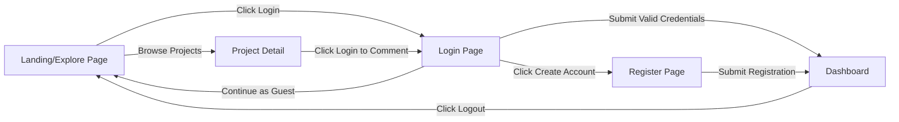
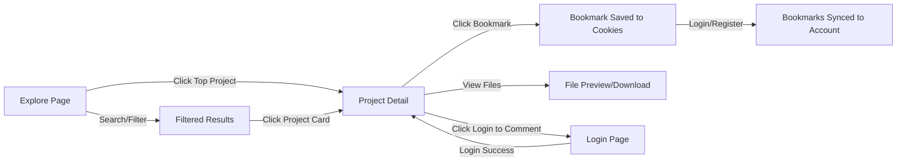
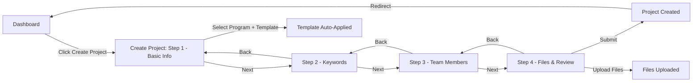
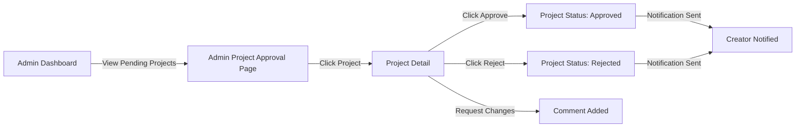
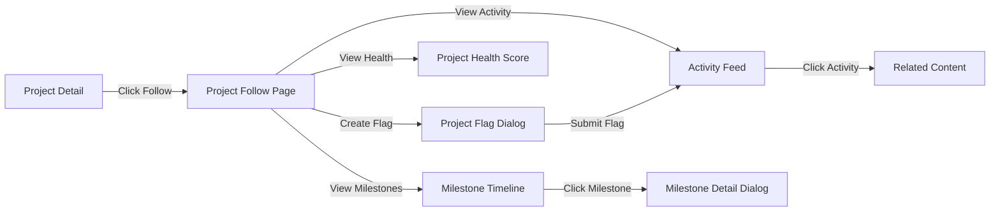

# UI Inventory & UX Interaction Report

## Project Overview

* **Application Name:** Fahras - Graduation Project Archiving System
* **Technology Stack:** React 18 + TypeScript, Material-UI v7, React Router v7
* **Audit Objective:** Mapping user journeys and interaction logic for UX optimization
* **Audit Date:** 2026-01-07
* **Architecture:** SPA with role-based access control (Guest, Student, Faculty, Admin, Reviewer)

---

## Navigation Structure

### Primary Routes

The application uses slug-based routing for projects (`/pr/:slug`) and role-based protection for sensitive pages.

**Public Routes** (No authentication required):
- `/` - Explore Page (Landing/Homepage)
- `/explore` - Explore Page
- `/home` - Home Page
- `/login` - Login Page
- `/register` - Register Page
- `/bookmarks` - My Bookmarks Page (works for both guests and authenticated users)
- `/pr/:slug` - Project Detail Page (accessible by guests with optional auth)

**Protected Routes** (Authentication required):
- `/dashboard` - Role-specific Dashboard
- `/profile` - User Profile
- `/settings` - User Settings
- `/notifications` - Notifications Page
- `/analytics` - Analytics Page
- `/pr/create` - Create Project (blocked for reviewers)
- `/pr/:slug/edit` - Edit Project (blocked for reviewers)
- `/pr/:slug/follow` - Project Follow Management
- `/pr/:slug/code` - Repository/Code Browser

**Admin-Only Routes**:
- `/users` - User Management
- `/approvals` - Approvals Management
- `/admin/projects` - Admin Project Approval
- `/admin/access-control` - Access Control & Roles Management
- `/admin/milestone-templates` - Milestone Template Configuration

**Faculty-Only Routes**:
- `/evaluations` - Project Evaluations
- `/advisor-projects` - Faculty Dashboard (Advisor's Projects)
- `/faculty/pending-approval` - Faculty Pending Approval Page

**Student-Only Routes**:
- `/student/my-projects` - Student My Projects Page

---

## Page: Header (Global Component)

> **Description:** Global navigation header displayed on all pages. Includes branding, language switcher, and authentication CTA.

| Element | Type | Label/Icon | Action (Trigger) | Destination/Result | UX Insight |
| --- | --- | --- | --- | --- | --- |
| **Logo Avatar** | Avatar | Rocket Icon | None (Visual) | N/A | Strong visual branding with gradient background. Good contrast. |
| **App Title** | Typography | "TVTC Project Explorer" | None (Visual) | N/A | Clear, descriptive title. Responsive font sizing. |
| **Language Switcher** | Component | Language Selector | Toggle | Changes UI language | Supports i18n. Good accessibility for bilingual users. |
| **Login Button** | Button | "Login" + Login Icon | Navigation | `/login` | Prominent CTA with gradient styling. Good visual hierarchy. Smooth hover animation. |

---

## Page: Explore Page (Landing/Public)

> **Description:** Main public-facing page for discovering graduation projects. Features hero section, search/filters, top projects showcase, and project grid.

| Element | Type | Label/Icon | Action (Trigger) | Destination/Result | UX Insight |
| --- | --- | --- | --- | --- | --- |
| **Hero Section** | Paper | "Explore Innovation 🚀" | None (Visual) | N/A | Engaging hero with gradient background, large heading, and descriptive copy. Good emotional appeal. |
| **Search Input** | TextField | Search text | Text Input | Updates filter state | Part of AdvancedFilters component. Real-time state update. |
| **Filter Toggle** | Button | "Advanced Filters" icon | Toggle | Shows/hides filter panel | Collapsible filters reduce clutter. Good progressive disclosure. |
| **Program Filter** | Select | Program dropdown | Selection | Updates filter state | Filters projects by academic program. Populated from API. |
| **Department Filter** | Select | Department dropdown | Selection | Updates filter state | Filters by department. Dynamic options. |
| **Academic Year Filter** | TextField | Year input | Text Input | Updates filter state | Free-form text input for academic year (e.g., "2024-2025"). |
| **Semester Filter** | Select | Semester dropdown | Selection | Updates filter state | Options: Fall, Spring, Summer. |
| **Sort By Filter** | Select | Sort field selector | Selection | Updates filter state | Controls sorting criteria (created_at, title, rating, etc.). |
| **Sort Order Filter** | Select | Sort direction | Selection | Updates filter state | Ascending/Descending toggle. |
| **Search Button** | Button | "Search" + Search Icon | API Call | Fetches filtered projects | Primary action. Triggers search with current filters. Smooth animation. |
| **Clear Filters Button** | Button | "Clear Filters" + Clear Icon | State Reset | Resets filters to default | Secondary action. Prominent when filters are active. |
| **Top Projects Badge** | Chip | "Top Projects ⭐" | None (Visual) | N/A | Visual indicator for high-rated projects section. |
| **Project Card** | Card | Project info | Click | `/pr/:slug` | Navigates to project detail. Hover animation (lift + scale). Good tactile feedback. |
| **Project Rating** | Display | Star rating | None (Visual) | N/A | Shows average rating and count. Visual feedback. |
| **Bookmark Button** | IconButton | Bookmark icon | Toggle + API Call | Adds/removes bookmark | Works for both guests (cookies) and authenticated users (DB). |
| **Refresh Button** | Button | "Refresh Page" | Reload | Reloads page | Shown when no projects found. Good recovery path. |

**UX Insights:**
- Strong visual hierarchy with hero → filters → results flow
- Excellent use of progressive disclosure (collapsible filters)
- Smooth animations enhance perceived performance
- Guest users can browse and bookmark (synced on login)
- Empty states provide clear recovery actions

---

## Page: Login Page

> **Description:** Authentication page for users to sign in. Includes email/password form, guest mode option, and registration link.

| Element | Type | Label/Icon | Action (Trigger) | Destination/Result | UX Insight |
| --- | --- | --- | --- | --- | --- |
| **TVTC Logo** | Logo Component | TVTC branding | None (Visual) | N/A | Professional branding. Large size for recognition. |
| **App Title** | Typography | "Fahras" | None (Visual) | N/A | Clear app identity alongside logo. |
| **Welcome Message** | Typography | "Welcome Back" | None (Visual) | N/A | Friendly, welcoming tone. |
| **Email Input** | TextField | "Email Address" + Email Icon | Text Input | Updates form state | Required field. Email validation. Icon improves scannability. |
| **Password Input** | TextField | "Password" + Lock Icon | Password Input | Updates form state | Required field. Masked input for security. |
| **Forgot Password Link** | Link Button | "Forgot Password?" | Alert Dialog | Alert placeholder | Functionality not yet implemented. Right-aligned for convention. |
| **Sign In Button** | Button | "Sign In" + Login Icon | Form Submit + API Call | `/dashboard` (on success) | Primary CTA. Disabled while loading. Shows loading spinner. |
| **Divider** | Visual | "or" text | None (Visual) | N/A | Separates primary and secondary actions. |
| **Continue as Guest** | Button | "Continue as Guest" + Eye Icon | Navigation | `/explore` | Outlined style for secondary action. Good guest UX. |
| **Create Account Link** | Link | "Create Account" | Navigation | `/register` | Clear call-to-action for new users. Bottom placement follows convention. |

**UX Insights:**
- Clean, focused layout with minimal distractions
- Good error handling with field-level validation
- Guest mode lowers barrier to entry
- "Forgot Password" link positioned per convention (top-right of password field)
- Loading states prevent double submission
- Smooth transition on successful login

---

## Page: Dashboard (Role-Based)

> **Description:** Central hub after login. Displays role-specific dashboard based on user type (Admin, Faculty, Student, Reviewer).

| Element | Type | Label/Icon | Action (Trigger) | Destination/Result | UX Insight |
| --- | --- | --- | --- | --- | --- |
| **App Bar** | AppBar | Header bar | None (Visual) | N/A | Clean white background with subtle shadow. |
| **TVTC Logo (Header)** | Logo | TVTC icon | None (Visual) | N/A | Consistent branding in app header. |
| **Dashboard Title** | Typography | "Fahras Dashboard" | None (Visual) | N/A | Clear page identification. |
| **User Avatar** | Avatar | User initials | Menu trigger | Opens user menu | Shows first letter of user's name. Good personalization. |
| **User Menu** | Menu | Dropdown | None | N/A | Opens on avatar click. Contains profile and logout options. |
| **Profile Menu Item** | MenuItem | "Profile" + Person Icon | Navigation | `/profile` | Quick access to user profile. |
| **Project Approvals Menu** | MenuItem | "Project Approvals" + Assignment Icon | Navigation | `/admin/projects` | Admin-only option. Conditional rendering. |
| **Logout Menu Item** | MenuItem | "Logout" + Exit Icon | Auth Action | `/login` | Clears session and redirects. |
| **Dashboard Content** | Component | Role-specific dashboard | Varies | Varies | Dynamically renders based on user role (AdminDashboard, FacultyDashboard, StudentDashboard, ReviewerDashboard). |

**UX Insights:**
- Role-based dashboard ensures users see relevant content only
- Persistent header provides consistent navigation
- User menu is discoverable and follows platform conventions
- Admin features are properly gated with role checks
- Clean separation between navigation and content

---

## Page: Project Detail Page

> **Description:** Detailed view of a single project. Shows metadata, files, team members, ratings, comments. Supports guest and authenticated access.

| Element | Type | Label/Icon | Action (Trigger) | Destination/Result | UX Insight |
| --- | --- | --- | --- | --- | --- |
| **Back Button** | IconButton | Back Arrow | Navigation | Previous page or `/dashboard` | Smart back navigation (respects history). |
| **Project Header** | Component | Title, status, actions | None (Container) | N/A | Sticky header for context awareness. |
| **Edit Button** | Button | "Edit" + Edit Icon | Navigation | `/pr/:slug/edit` | Shown only to project owner or admin. Good permission gating. |
| **Delete Button** | Button | "Delete" + Delete Icon | Confirmation + API Call | Deletes project → `/dashboard` | Destructive action. Uses browser confirm dialog. Should use custom modal. |
| **Export Button** | Button | "Export" + Export Icon | Opens Dialog | Opens ProjectExportDialog | Allows exporting project data. |
| **Follow Button** | Button | "Follow Project" | Navigation | `/pr/:slug/follow` | Navigates to project follow management page. Auth required. |
| **Status Badge** | Chip | Current status | Click (if can edit) | Opens StatusSelector dialog | Visual indicator. Clickable for owners/admins. |
| **Repository Link** | Button | "View Code" + Code Icon | Navigation | `/pr/:slug/code` | Links to GitHub-style repository browser. Auth required. |
| **Project Files Section** | Component | File list | None (Container) | N/A | Lists all project files with download links. |
| **File Download Link** | Link | Filename + File Icon | Download | Downloads file | Direct download link. Shows file size and type. |
| **Project Metadata Sidebar** | Component | Metadata cards | None (Container) | N/A | Shows program, members, advisors, dates in sidebar. |
| **Rating Section** | Component | Star rating + reviews | Rate | Submits rating | Allows authenticated users to rate. Shows aggregate ratings. |
| **Comment Section** | Component | Comments + input | Post comment | Adds comment | Threaded comments. Auth required to post. |
| **Status Selector Dialog** | Dialog | Status options | Select + Save | Updates project status | Modal for changing project status. Owner/admin only. |
| **Export Dialog** | Dialog | Export options | Generate + Download | Generates export file | Supports multiple formats (PDF, JSON, etc.). |

**UX Insights:**
- Comprehensive project information in organized layout
- Clear visual hierarchy (header → main content → sidebar)
- Conditional rendering based on user permissions (edit, delete, rate)
- Guest users can view but not interact (rate, comment)
- File management could use bulk actions
- Sticky header helps maintain context during scroll
- Smooth animations on section transitions (Fade, Slide)

---

## Page: Create Project Page

> **Description:** Multi-step form for creating new projects. Includes basic info, keywords, team members, and file uploads. Restricted from reviewers/admins.

| Element | Type | Label/Icon | Action (Trigger) | Destination/Result | UX Insight |
| --- | --- | --- | --- | --- | --- |
| **Back Button (AppBar)** | IconButton | Back Arrow | Navigation | `/dashboard` | Persistent in AppBar. Clear exit path. |
| **Page Title** | Typography | "Create New Project" | None (Visual) | N/A | Clear page identification in AppBar. |
| **Step Indicator** | Stepper | 4 steps | Step Navigation | Changes active step | Visual progress indicator. Shows: Basic Info, Keywords, Team, Files. |
| **Program Selector** | Component | Program dropdown + template | Selection | Updates program and template | Integrated with ProgramTemplateSelector. Shows available milestone templates. |
| **Template Selector** | Selector | Template cards | Selection | Sets milestone template | Optional. Applies template to project on creation. |
| **Project Title Input** | TextField | "Project Title" | Text Input | Updates form state | Required field. Validation on blur. |
| **Abstract Input** | TextField (Multiline) | "Abstract" | Text Input | Updates form state | Required. 6 rows. Clear helper text. |
| **Academic Year Input** | TextField | "Academic Year" | Text Input | Updates form state | Format: YYYY-YYYY. Auto-populated with current year. Validation for format. |
| **Semester Select** | Select | "Semester" | Selection | Updates form state | Options: Fall, Spring, Summer. Auto-populated with current semester. |
| **Keyword Input** | TextField | "Add keyword" | Text Input + Enter | Adds keyword chip | Supports Enter key for quick addition. Focus returns to input after add. |
| **Add Keyword Button** | Button | "Add Keyword" + Plus Icon | Click | Adds keyword chip | Disabled when input empty. |
| **Keyword Chip** | Chip | Keyword text | Delete | Removes keyword | Each keyword deletable. Primary color. |
| **Member Autocomplete** | Autocomplete | User search | Selection/Type | Adds member | Supports both selecting from list and free-text entry (for non-registered members). |
| **Member Role Select** | Select | "Role" | Selection | Sets member role | Options: Lead, Member. |
| **Add Member Button** | Button | "Add" + Plus Icon | Click | Adds member to list | Disabled when no user selected. |
| **Member List Item** | ListItem | Member info | None | N/A | Shows avatar, name, role chip. Creator marked with "Creator" badge. |
| **Remove Member Button** | IconButton | Delete Icon | Click | Removes member | Disabled for project creator. Good prevention of invalid state. |
| **Advisor Autocomplete** | Autocomplete | User search | Selection/Type | Adds advisor | Same pattern as members. Supports custom names. |
| **Advisor Role Select** | Select | "Role" | Selection | Sets advisor role | Options: Main Advisor, Co-Advisor, Reviewer. |
| **Add Advisor Button** | Button | "Add" + Plus Icon | Click | Adds advisor to list | Optional advisors. |
| **Advisor List Item** | ListItem | Advisor info | None | N/A | Shows avatar, name, role chip. Secondary color. |
| **Remove Advisor Button** | IconButton | Delete Icon | Click | Removes advisor | No restrictions on removal. |
| **File Upload Input** | Input (Hidden) | File selection | File Select | Adds files to list | Hidden input. Triggered by label click. |
| **Upload Files Button** | Button (Label) | "Upload Files" + Cloud Icon | Opens File Dialog | Selects files | Outlined style. Shows supported formats in helper text. |
| **GitHub URL Input** | TextField | "GitHub URL" | Text Input | Updates form state | Optional. Shows code icon. |
| **File List Item** | ListItem | File info | None | N/A | Shows filename, size, remove button. |
| **Remove File Button** | IconButton | Delete Icon | Click | Removes file | Pre-upload removal. |
| **Review Summary** | Box | Project summary | None (Visual) | N/A | Shows all entered data for final review before submission. |
| **Back Button (Steps)** | Button | "Back" + Arrow | Click | Previous step | Disabled on first step. |
| **Next Button** | Button | "Next" + Arrow | Click + Validation | Next step | Validates current step before advancing. |
| **Create Project Button** | Button | "Create Project" + Save Icon | Form Submit + API Call | Creates project → `/dashboard` | Final step only. Disabled while loading. Shows "Creating..." during submit. |

**UX Insights:**
- Excellent use of stepped progression reduces cognitive load
- Smart auto-population (academic year, semester) reduces user effort
- Keyword input with Enter key support speeds data entry
- Creator automatically added as LEAD member (cannot be removed)
- Supports both registered users and custom names for members/advisors
- Real-time validation with clear error messages
- File upload shows format restrictions upfront
- Review step prevents errors before submission
- Success message before redirect provides closure
- Could benefit from draft save functionality
- Template selector integrated in first step is clever UX

---

## Page: Explore - Project Grid (Component)

> **Description:** Reusable grid component for displaying project cards. Used in Explore page for both top projects and all projects sections.

| Element | Type | Label/Icon | Action (Trigger) | Destination/Result | UX Insight |
| --- | --- | --- | --- | --- | --- |
| **Project Card** | Card | Project info | Click | `/pr/:slug` | Responsive grid layout. Smooth hover animations (lift + scale). |
| **Top Project Badge** | Chip | "⭐ Top Project" | None (Visual) | N/A | Shown on top-rated projects. Good visual distinction. |
| **Project Title** | Typography | Title text | None (Part of card click) | N/A | Bold, prominent. Truncated if too long. |
| **Project Abstract** | Typography | Abstract preview | None (Part of card click) | N/A | Truncated to 120 chars. Provides context. |
| **Status Chip** | Chip | Status label | None (Visual) | N/A | Color-coded by status. Good visual feedback. |
| **Academic Info** | Typography | Year + Semester | None (Visual) | N/A | Shows academic context. Compact display. |
| **Creator Info** | Typography | Creator name | None (Visual) | N/A | Shows project creator. Person icon for context. |
| **Bookmark Button** | IconButton | Bookmark icon | Toggle + API Call | Adds/removes bookmark | Stops propagation (doesn't trigger card click). Works for guests. |
| **Rating Display** | Display | Stars + count | None (Visual) | N/A | Shows average rating and number of ratings. |

**UX Insights:**
- Cards have excellent hover feedback (transform + shadow)
- Active state (on click) provides tactile feedback (scale down)
- Good information density without clutter
- Bookmark action isolated from card click (good event handling)
- Top project badge provides clear visual distinction
- Responsive grid adapts to screen size
- Truncated text prevents layout breaking

---

## Page: Project Card (Reusable Component)

> **Description:** Reusable project card component used in dashboards and project lists. Supports different themes, progress indicators, and action buttons.

| Element | Type | Label/Icon | Action (Trigger) | Destination/Result | UX Insight |
| --- | --- | --- | --- | --- | --- |
| **Card Container** | Card | Project content | Click | Project detail page (slug-based) | Theme-aware styling. Hover animation. |
| **School Icon** | Icon | School building | None (Visual) | N/A | Visual indicator for academic project. |
| **Project Title** | Typography | Title text | None (Part of card) | N/A | Bold, prominent. Flex layout. |
| **Status Chip** | Chip | Status label | None (Visual) | N/A | Color-coded. Capitalized text. |
| **Abstract Preview** | Typography | Abstract text | None (Part of card) | N/A | Truncated to 120 chars. Min height for consistency. |
| **Progress Bar** | LinearProgress | Progress % | None (Visual) | N/A | Conditional (showProgress). Shows project completion. |
| **Progress Label** | Typography | "Progress" + percentage | None (Visual) | N/A | Shows percentage value. Theme-colored. |
| **Calendar Info** | Box | Year + Semester | None (Visual) | N/A | Calendar icon + text. Compact. |
| **Approval Status Chip** | Chip | Admin approval status | None (Visual) | N/A | Conditional (showApprovalStatus). Color-coded. |
| **Creator Info** | Box | Creator name | None (Visual) | N/A | Person icon + name. |
| **Edit Button** | IconButton | Edit icon | Navigation (stops propagation) | Edit project page | Conditional (showEdit). Theme-colored. |
| **View Button** | IconButton | Eye icon | Navigation (stops propagation) | Project detail page | Theme-colored. Always shown. |

**UX Insights:**
- Highly flexible component with props for different contexts
- Theme-aware styling allows customization per dashboard
- Progress bar provides visual completion indicator
- Good separation of concerns (view vs edit actions)
- Event propagation handled correctly (buttons don't trigger card click)
- Uses new slug-based routing via utility function
- Min-height on abstract prevents layout shift

---

## Shared Components & Patterns

### Navigation & Layout

| Component | Purpose | Key Interactions |
| --- | --- | --- |
| **Header** | Global navigation | Login button, language switcher, branding |
| **HeaderLogo** | TVTC branding | Displays in header and footer. Variants: icon, full, footer |
| **ProtectedRoute** | Auth guard | Redirects to `/login` if not authenticated |
| **RoleProtectedRoute** | Role-based guard | Checks allowed/restricted roles. Redirects to `/dashboard` if unauthorized |
| **ErrorBoundary** | Error handling | Catches React errors. Shows fallback UI |
| **PageTransition** | Page animations | Fade/slide transitions between pages |

### Form Components

| Component | Purpose | Key Interactions |
| --- | --- | --- |
| **LanguageSwitcher** | I18n toggle | Switches between English/Arabic. Updates theme direction (LTR/RTL) |
| **UniversalSearchBox** | Global search | Searches projects, users, files across app |
| **StatusSelector** | Project status | Dialog for updating project status (Draft, Submitted, etc.) |
| **ProjectVisibilityToggle** | Visibility control | Toggles project public/private |

### Project Components

| Component | Purpose | Key Interactions |
| --- | --- | --- |
| **ProjectCard** | Project preview | Clickable card with metadata, status, actions |
| **ProjectTable** | Project list (table) | Sortable, filterable table view of projects |
| **ProjectHeader** | Project detail header | Title, actions (edit, delete, export, follow) |
| **ProjectMainInfo** | Project details | Shows description, metadata, status |
| **ProjectFiles** | File management | File list, upload, download |
| **ProjectSidebar** | Project metadata | Team members, advisors, dates, stats |
| **ProjectInfo** | Project metadata display | Read-only project information |
| **BookmarkButton** | Bookmark toggle | Adds/removes project from bookmarks |
| **ProjectInteractions** | Social actions | Like, share, bookmark buttons |

### Advanced Components

| Component | Purpose | Key Interactions |
| --- | --- | --- |
| **AdvancedFilters** | Search filters | Collapsible filter panel with multiple criteria |
| **ProjectGrid** | Responsive grid | Grid layout for project cards |
| **ProjectSearch** | Project search | Search input with autocomplete |
| **CommentSection** | Comments | Threaded comments, reply, delete |
| **RatingSection** | Ratings | Star rating input, average display, rating list |
| **ProjectExportDialog** | Export | Generates PDF/JSON export of project |
| **ProjectApprovalActions** | Approval workflow | Approve/reject buttons (admin/faculty) |
| **MilestoneTimeline** | Milestone visualization | Timeline view of project milestones |
| **ActivityFeed** | Activity log | Chronological list of project activities |
| **ProjectFollowers** | Follower list | Shows users following project |
| **ProjectFlags** | Issue flags | Flag creation, severity levels |
| **ProjectHealthScore** | Project health | Visual indicator of project health metrics |

### Access Control Components

| Component | Purpose | Key Interactions |
| --- | --- | --- |
| **RolesTab** | Role management | CRUD for roles |
| **PermissionsTab** | Permission management | Assign permissions to roles |
| **UsersTab** | User management | User list, role assignment |
| **RoleCard** | Role display | Shows role info, edit/delete actions |
| **RoleDialog** | Role create/edit | Modal for role CRUD |
| **PermissionSelector** | Permission picker | Multi-select for permissions |
| **AnalyticsTab** | Access analytics | Analytics for access control |

### Repository Components

| Component | Purpose | Key Interactions |
| --- | --- | --- |
| **RepositoryLayout** | GitHub-like layout | Container for repository views |
| **RepositoryHeader** | Repo navigation | Tabs, breadcrumbs, actions |
| **RepositoryTabs** | Tab navigation | Code, Issues, Commits tabs |
| **FileBrowser** | File tree | Navigable file/folder structure |
| **FileContentViewer** | File display | Syntax-highlighted code viewer |

### Dashboard Components

| Component | Purpose | Key Interactions |
| --- | --- | --- |
| **AdminDashboard** | Admin overview | Stats, charts, quick actions |
| **FacultyDashboard** | Faculty overview | Advised projects, evaluations |
| **FacultyHomeDashboard** | Faculty home | Personalized faculty dashboard |
| **StudentDashboard** | Student overview | My projects, deadlines |
| **ReviewerDashboard** | Reviewer overview | Projects to review |
| **DashboardContainer** | Dashboard layout | Reusable dashboard wrapper |
| **DashboardHeader** | Dashboard header | Title, breadcrumbs, actions |
| **StatsCard** | Metric display | Shows a single metric with icon |
| **QuickActions** | Action buttons | Common dashboard actions |

---

## User Flows

### Authentication Flow



### Project Discovery Flow (Guest User)



### Project Creation Flow (Student/Faculty)



### Project Approval Flow (Admin)



### Project Follow Flow (Faculty/Student)



---

## UX Summary & Friction Points

### Strengths

1. **Progressive Disclosure**: Advanced filters, stepped form, collapsible sections reduce cognitive load
2. **Smart Defaults**: Auto-populated academic year/semester, creator as default lead member
3. **Guest Experience**: Bookmarks work for guests and sync on login (excellent retention strategy)
4. **Responsive Design**: Mobile-first approach with Material-UI Grid v7 (`size` prop)
5. **Smooth Animations**: Page transitions, card hover effects enhance perceived performance
6. **Role-Based UX**: Different dashboards and permissions for each user type
7. **Defensive Programming**: Safe data access patterns (`?.`, `|| []`) prevent crashes
8. **Visual Feedback**: Loading states, error messages, success toasts, progress indicators
9. **Accessibility**: Icon + text labels, semantic HTML, ARIA labels
10. **I18n Support**: RTL/LTR support with dynamic theme direction

### Navigation Issues

1. **Inconsistent Back Navigation**: Some pages use browser back, others navigate to fixed routes
2. **Deep Linking**: Project follow page requires going through project detail first
3. **Breadcrumbs**: Missing on deep pages (repository, milestone management)

### Consistency Issues

1. **Confirmation Dialogs**: Mix of browser `confirm()` and custom modals (delete project uses alert)
2. **Error Handling**: Some components show inline errors, others use Snackbar/Alert
3. **Button Styles**: Inconsistent use of contained/outlined/text variants across pages
4. **Icon Placement**: startIcon/endIcon usage not standardized

### Accessibility Issues

1. **Color Contrast**: Some secondary text may not meet WCAG AA standards
2. **Focus Management**: Modal dialogs might not trap focus properly
3. **Keyboard Navigation**: Not all interactive elements have visible focus indicators
4. **Screen Reader**: Some dynamic content updates might not announce changes
5. **Alt Text**: Images and icons might be missing descriptive text for screen readers

### Data Input Issues

1. **Academic Year Format**: Free-text input prone to errors (should be a year range picker)
2. **Autocomplete Keyboard**: Autocomplete components might need better keyboard support
3. **File Upload**: No drag-and-drop support
4. **Batch Operations**: No bulk actions for files, members, keywords
5. **Unsaved Changes**: No warning when navigating away from forms with unsaved data

### Performance Concerns

1. **Large Lists**: Project grid/table might lag with 1000+ projects (no virtualization)
2. **Image Optimization**: No lazy loading for project thumbnails
3. **Bundle Size**: Large number of Material-UI components might increase initial load
4. **API Calls**: Some pages make sequential API calls instead of parallel

### Missing Features

1. **Forgot Password**: Link present but functionality not implemented
2. **Draft Save**: No auto-save or draft functionality in create/edit forms
3. **Undo Actions**: No undo for destructive actions (delete, remove member)
4. **Search History**: No saved searches or recent searches
5. **Keyboard Shortcuts**: No global keyboard shortcuts for common actions
6. **Offline Support**: No PWA features or offline capabilities

---

## Recommended Improvements

### High Priority

1. **Replace browser confirm() with custom modal** for delete confirmation
   - Better UX, more control, consistent styling
   - Add "Are you sure?" with consequences explanation

2. **Add breadcrumb navigation** to deep pages
   - Especially for repository browser, admin pages
   - Helps users understand their location

3. **Implement forgot password** functionality
   - Link already exists, users expect it to work
   - Consider magic link or email reset

4. **Add unsaved changes warning**
   - Prevent accidental data loss
   - Show modal when navigating away from dirty forms

5. **Standardize error handling patterns**
   - Use consistent Alert/Snackbar placement
   - Field-level errors for forms, toast for global errors

### Medium Priority

1. **Add virtual scrolling** for large project lists
   - Use `react-window` or `react-virtualized`
   - Improves performance with 100+ items

2. **Implement drag-and-drop file upload**
   - Modern UX pattern users expect
   - Add drop zone visual feedback

3. **Add bulk actions** for management tasks
   - Select multiple projects, files, users
   - Batch delete, export, approve

4. **Improve academic year input**
   - Replace text field with year range picker
   - Add current/next year quick selectors

5. **Add keyboard shortcuts**
   - Global search (Cmd/Ctrl+K)
   - Quick actions (N for new project, etc.)

### Low Priority

1. **Add dark mode toggle**
   - Theme context already supports it
   - Popular user request

2. **Implement search history**
   - Save recent searches
   - Quick re-run of common filters

3. **Add project templates**
   - Pre-fill common project structures
   - Reduce repetitive data entry

4. **Implement activity notifications**
   - Real-time updates for followed projects
   - Email/push notifications

5. **Add export presets**
   - Save common export configurations
   - One-click export to PDF/JSON

---

## Component Dependency Map

### Core Dependencies

```
App.tsx
├── LanguageProvider (Context)
├── ThemeProvider (MUI + Custom)
├── Router (React Router v7)
└── Routes
    ├── Public Routes
    │   ├── ExplorePage
    │   │   ├── AdvancedFilters
    │   │   └── ProjectGrid
    │   │       └── ProjectCard (Shared)
    │   ├── LoginPage
    │   │   └── TVTCLogo
    │   ├── RegisterPage
    │   └── ProjectDetailPage (Guest + Auth)
    │       ├── ProjectHeader
    │       ├── ProjectMainInfo
    │       ├── ProjectFiles
    │       ├── ProjectSidebar
    │       ├── CommentSection
    │       └── RatingSection
    │
    ├── Protected Routes
    │   ├── DashboardPage
    │   │   ├── AdminDashboard
    │   │   ├── FacultyDashboard / FacultyHomeDashboard
    │   │   ├── StudentDashboard
    │   │   └── ReviewerDashboard
    │   ├── CreateProjectPage
    │   │   └── ProgramTemplateSelector
    │   ├── EditProjectPage
    │   ├── ProjectFollowPage
    │   │   ├── MilestoneTimeline
    │   │   ├── ActivityFeed
    │   │   ├── ProjectHealthScore
    │   │   └── ProjectFlags
    │   └── RepositoryPage
    │       ├── RepositoryLayout
    │       ├── RepositoryTabs
    │       ├── FileBrowser
    │       └── FileContentViewer
    │
    └── Admin Routes
        ├── UserManagementPage
        ├── AccessControlPage
        │   ├── RolesTab
        │   ├── PermissionsTab
        │   └── UsersTab
        └── MilestoneTemplateConfigPage
```

---

## State Management Architecture

### Zustand Stores

1. **authStore.ts**
   - Current user data
   - Authentication token
   - Login/logout/register actions
   - Persisted to localStorage

2. **repositoryStore.ts**
   - Repository/project state
   - File tree state
   - Current file selection

### Context Providers

1. **LanguageContext**
   - Current language (en/ar)
   - Translation function `t()`
   - Direction (LTR/RTL)

2. **ThemeContext**
   - Theme mode (light/dark)
   - Custom theme configuration
   - TVTC branding colors

### API Service Layer

- **apiService** (Singleton)
  - Axios instance with interceptors
  - Auth token injection
  - 401 handling (auto-logout)
  - All API endpoints typed with TypeScript

---

## Technical Patterns

### Material-UI v7 Grid Usage

```typescript
// ✅ Correct v7 syntax
<Grid size={{ xs: 12, md: 6 }}>
  <Card>Content</Card>
</Grid>

// ❌ Old v4 syntax (deprecated)
<Grid item xs={12} md={6}>
  <Card>Content</Card>
</Grid>
```

### Safe Data Access

```typescript
// ✅ Correct defensive pattern
{(items || []).map(item => <div key={item.id}>{item.name}</div>)}
const userName = user?.full_name || 'Unknown';

// ❌ Wrong (crash if items is null/undefined)
{items.map(item => <div key={item.id}>{item.name}</div>)}
```

### Role-Based Rendering

```typescript
// Check user roles
const isAdmin = user?.roles?.some(role => role.name === 'admin');
const canEdit = user && (user.id === project.created_by_user_id || isAdmin);

// Conditional rendering
{canEdit && (
  <Button onClick={handleEdit}>Edit</Button>
)}
```

### API Response Handling

```typescript
// Handle various response structures
const response = await apiService.getData();
const data = response.data || response || [];

// Always return fallback on error
try {
  return await apiService.getData();
} catch (error) {
  console.error('API Error:', error);
  return []; // Fallback
}
```

---

## Conclusion

Fahras is a well-architected graduation project archiving system with strong UX foundations. The application excels in progressive disclosure, role-based access control, and guest user experience. Key strengths include smooth animations, defensive programming patterns, and a comprehensive component library.

Priority improvements should focus on standardizing confirmation dialogs, implementing unsaved changes warnings, and adding breadcrumb navigation. Performance optimizations for large lists and improved accessibility would further enhance the user experience.

The codebase demonstrates mature React patterns with TypeScript, Material-UI v7, and modern state management. The modular component structure enables rapid feature development while maintaining consistency.
