# Fahras Project Structure - UI/UX Focus

## Project Overview
**Fahras** is a comprehensive graduation project management system built for TVTC (Technical and Vocational Training Corporation) using Laravel (API) + React (Frontend) architecture.

---

## System Architecture

### Frontend Structure


### Backend Structure

```mermaid
graph TD
    subgraph Backend["🔧 Backend (Laravel API)"]
        subgraph Controllers["🎮 Controllers"]
            ProjCtrl["ProjectController"]
            UserCtrl["UserController"]
            NotifCtrl["NotificationController"]
            AuthCtrl["AuthController"]
        end
        
        subgraph Models["📊 Models"]
            User["User"]
            Project["Project"]
            File["File"]
            Notification["Notification"]
            Program["Program"]
            Department["Department"]
            Student["Student"]
            Faculty["Faculty"]
            Role["Role"]
            Permission["Permission"]
        end
        
        subgraph Database["🗄️ Database Tables"]
            users["users"]
            projects["projects"]
            files["files"]
            notifications["notifications"]
            programs["programs"]
            departments["departments"]
            students["students"]
            faculty["faculty"]
            roles["roles"]
            permissions["permissions"]
            members["project_members"]
            advisors["project_advisors"]
        end
    end
```



### Analytics & Data Flow

```mermaid
graph TD
    subgraph Analytics["📈 Analytics & Data Flow"]
        AnalyticsAPI["Project Analytics API"]
        StatusDist["Status Distribution"]
        DeptAnalytics["Department Analytics"]
        MonthlyTrends["Monthly Trends"]
        UserActivity["User Activity Tracking"]
        FileAnalytics["File Upload Analytics"]
    end
    
    AnalyticsAPI --> StatusDist
    AnalyticsAPI --> DeptAnalytics
    AnalyticsAPI --> MonthlyTrends
    AnalyticsAPI --> UserActivity
    AnalyticsAPI --> FileAnalytics
```



### System Connections

```mermaid
graph LR
    subgraph Frontend["🎨 Frontend"]
        API["apiService"]
        Dashboard["DashboardPage"]
        Analytics["AnalyticsPage"]
        Create["CreateProjectPage"]
        Detail["ProjectDetailPage"]
        Search["ProjectSearch"]
        Notifications["NotificationCenter"]
        Protected["ProtectedRoute"]
        Interactions["ProjectInteractions"]
    end
    
    subgraph Backend["🔧 Backend"]
        ProjCtrl["ProjectController"]
        UserCtrl["UserController"]
        NotifCtrl["NotificationController"]
        AuthCtrl["AuthController"]
    end
    
    subgraph Models["📊 Models"]
        User["User"]
        Project["Project"]
        File["File"]
        Notification["Notification"]
    end
    
    subgraph Database["🗄️ Database"]
        users["users"]
        projects["projects"]
        files["files"]
        notifications["notifications"]
    end
    
    %% Frontend to Backend connections
    API --> ProjCtrl
    API --> UserCtrl
    API --> NotifCtrl
    API --> AuthCtrl
    
    %% Model to Database connections
    User --> users
    Project --> projects
    File --> files
    Notification --> notifications
    
    %% Component relationships
    Dashboard --> Search
    Dashboard --> Notifications
    Analytics --> Protected
    Create --> Protected
    Detail --> Interactions
```




## 🎨 UI/UX Architecture

### Design System
- **Framework**: Material-UI v7 with custom TVTC branding
- **Color Palette**: Professional blue (#1e3a8a) and green (#059669)
- **Typography**: Inter font family with hierarchical sizing
- **Components**: Customized MUI components with TVTC styling

### Key UI Components

#### 1. **Navigation & Layout**
- **AppBar**: Consistent header with TVTC branding
- **ProtectedRoute**: Authentication wrapper
- **Responsive Grid**: Material-UI Grid system with breakpoints

#### 2. **Search & Filtering**
- **ProjectSearch**: Advanced search with autocomplete
- **Filter Controls**: Status, department, program, academic year
- **Sort Options**: Multiple sorting criteria

#### 3. **Data Display**
- **Project Cards**: Grid layout with status indicators
- **Analytics Dashboard**: Charts and metrics visualization
- **Notification Center**: Real-time notifications drawer

#### 4. **Forms & Input**
- **CreateProjectPage**: Multi-step form with file upload
- **ProjectDetailPage**: Comprehensive project view
- **SettingsPage**: User preferences and configuration

## 📊 Analytics & Database Structure

### Database Schema

#### Core Tables
```sql
-- Users & Authentication
users (id, full_name, email, password, status, last_login_at)
roles (id, name, description)
permissions (id, code, description)
role_user (user_id, role_id)
permission_role (role_id, permission_id)

-- Academic Structure
departments (id, name)
programs (id, department_id, name, degree_level)
students (id, user_id, program_id, student_no, cohort_year)
faculty (id, user_id, department_id, faculty_no, is_supervisor)

-- Projects & Files
projects (id, program_id, created_by_user_id, title, abstract, keywords, 
          academic_year, semester, status, is_public, doi, repo_url)
project_members (id, project_id, user_id, role_in_project)
project_advisors (id, project_id, user_id, advisor_role)
files (id, project_id, uploaded_by_user_id, version, filename, 
       original_filename, mime_type, size_bytes, storage_url, checksum, is_public)

-- Notifications
notifications (id, user_id, project_id, type, title, message, data, 
               is_read, read_at)
```

### Analytics Features

#### 1. **Project Analytics Dashboard**
- **Status Distribution**: Visual breakdown of project statuses
- **Department Analytics**: Projects by department
- **Academic Year Trends**: Year-over-year project creation
- **Monthly Trends**: Project creation patterns over time
- **Recent Activity**: Last 30 days activity metrics

#### 2. **User Analytics**
- **Login Tracking**: User activity monitoring
- **Project Participation**: Member and advisor roles
- **File Upload Statistics**: Document management metrics

#### 3. **System Analytics**
- **Performance Metrics**: API response times
- **Storage Analytics**: File upload and storage usage
- **Notification Analytics**: User engagement tracking

## 🚀 React Pages & Components

### Main Pages

#### 1. **DashboardPage** (`/dashboard`)
- **Purpose**: Main project overview and management
- **Features**: 
  - Project grid with search/filter
  - Quick actions (Create, Analytics, Evaluations)
  - Notification center integration
  - Role-based content display

#### 2. **AnalyticsPage** (`/analytics`)
- **Purpose**: Comprehensive project analytics
- **Features**:
  - Overview cards (Total projects, Recent activity, Departments, Academic years)
  - Status distribution charts
  - Department and year breakdowns
  - Monthly trend analysis

#### 3. **CreateProjectPage** (`/projects/create`)
- **Purpose**: Project creation with team management
- **Features**:
  - Multi-section form (Basic info, Keywords, Team, Files)
  - Member and advisor assignment
  - File upload with preview
  - Real-time validation

#### 4. **ProjectDetailPage** (`/projects/:id`)
- **Purpose**: Comprehensive project view
- **Features**:
  - Project information display
  - Team member and advisor lists
  - File download interface
  - Project interactions (comments, ratings)

#### 5. **LoginPage** (`/login`)
- **Purpose**: User authentication
- **Features**:
  - TVTC branding
  - Form validation
  - Error handling
  - Redirect to dashboard

### Key Components

#### 1. **ProjectSearch**
- Advanced search with autocomplete
- Multiple filter options
- Collapsible advanced filters
- Real-time suggestions

#### 2. **NotificationCenter**
- Real-time notification display
- Mark as read functionality
- Notification categorization
- Delete notifications

#### 3. **TVTCBranding & TVTCLogo**
- Consistent branding across the app
- Multiple size variants
- Color customization
- Professional TVTC styling

## 🔧 Technical Implementation

### Frontend Stack
- **React 18** with TypeScript
- **Material-UI v7** for component library
- **React Router** for navigation
- **Zustand** for state management
- **Axios** for API communication

### Backend Stack
- **Laravel 10** with PHP 8.1+
- **MySQL** database
- **Laravel Sanctum** for API authentication
- **File storage** for document management

### Key Features
- **Responsive Design**: Mobile-first approach
- **Real-time Notifications**: WebSocket integration
- **File Management**: Upload, versioning, and download
- **Role-based Access**: Granular permissions
- **Analytics Dashboard**: Comprehensive reporting
- **Search & Filter**: Advanced project discovery

## 📱 User Experience Flow

### 1. **Authentication Flow**
```
Login → Dashboard → Project Management
```

### 2. **Project Creation Flow**
```
Dashboard → Create Project → Form Sections → Team Assignment → File Upload → Submit
```

### 3. **Analytics Flow**
```
Dashboard → Analytics → View Metrics → Filter Data → Export Reports
```

### 4. **Project Management Flow**
```
Dashboard → Search/Filter → View Project → Edit/Delete → Team Management
```

## 🎯 Key UI/UX Patterns

### 1. **Consistent Navigation**
- TVTC branding in header
- Breadcrumb navigation
- Contextual actions

### 2. **Data Visualization**
- Card-based layouts
- Status indicators with colors
- Progress tracking
- Interactive charts

### 3. **Form Design**
- Multi-step forms
- Real-time validation
- File upload with preview
- Team member management

### 4. **Responsive Design**
- Mobile-first approach
- Breakpoint-based layouts
- Touch-friendly interactions
- Accessible design patterns

This structure provides a comprehensive foundation for a modern, scalable project management system with strong emphasis on user experience, analytics, and data management.
