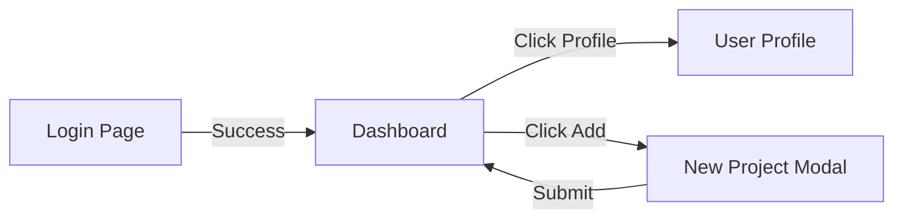

> **Role:** You are a Senior UX Researcher and Product Analyst.
> **Task:** Analyze the provided [Screenshots/Video/App Description] to create a detailed **UI Inventory and Interaction Map** for a UX study.
> **Requirements:**
> 1. **Screen Identification:** Name every unique screen or modal state found.
> 2. **Element Extraction:** List every clickable element (Buttons, Links, Icons, Inputs).
> 3. **Action Mapping:** For each element, specify:
> * **Label/ID:** Text or icon description.
> * **Interaction:** What happens on click (e.g., Navigate, Toggle, Submit).
> * **Destination:** Where the user ends up.
> * **UX Insight:** A brief note on clarity, placement, or friction.
> 
> 
> 
> 
> **Output Format:** Provide the results in **Markdown tables** grouped by page.

---

## 2. The Markdown Template (For your Documentation)

Use this structure to organize your findings in your project's `.md` file.

# UI Inventory & UX Interaction Report

## Project Overview

* **Application Name:** [Insert Name]
* **Audit Objective:** Mapping user journeys and interaction logic for UX optimization.

---

## Page: [Page Name, e.g., Dashboard]

> **Description:** The main overview page for authenticated users.

| Element | Type | Label/Icon | Action (Trigger) | Destination/Result | UX Insight |
| --- | --- | --- | --- | --- | --- |
| **Primary CTA** | Button | "Create New" | Opens Modal | New Project Form | High visibility; good contrast. |
| **Global Nav** | Icon | Settings Gear | Navigation | Settings Page | Icon is standard; easy to find. |
| **Filter Dropdown** | Select | "Sort By..." | UI State Change | Re-orders list | Needs a "Clear" button. |
| **Logout** | Link | "Sign Out" | Session Termination | Login Screen | Placed in sub-menu (Prevents accidental clicks). |

---

## Page: [Page Name, e.g., User Profile]

> **Description:** Page for managing personal account details.

| Element | Type | Label/Icon | Action (Trigger) | Destination/Result | UX Insight |
| --- | --- | --- | --- | --- | --- |
| **Avatar Upload** | Click Area | Camera Icon | File Picker | Local System Dialog | Needs a progress bar after upload. |
| **Save Changes** | Button | "Save" | API Call | Same Page (Toast) | Button should disable while loading. |

---

## 3. UX Summary & Friction Points

* **Navigation Issues:** (e.g., "The back button is missing on the payment confirmation screen.")
* **Consistency:** (e.g., "Blue buttons are used for both 'Save' and 'Delete' in different modules.")
* **Accessibility:** (e.g., "The contrast ratio on the footer links is too low.")

---

### Pro-Tip for your UX Study

If you want to visualize how these pages connect, you can use **Mermaid.js** syntax inside your Markdown file like this:

**Would you like me to generate a specific Mermaid diagram for a common flow, like "Onboarding" or "Checkout"?**